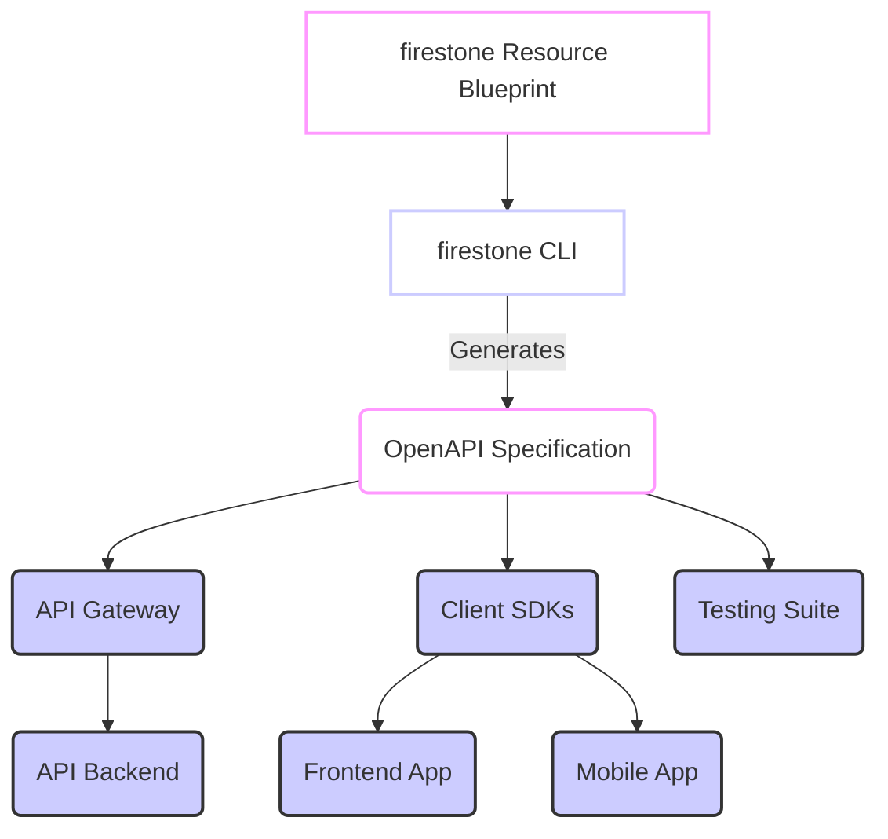

## Your API, Connected to the World

`firestone` generates OpenAPI specifications, a universal language for describing RESTful APIs. The true power of generating a standard OpenAPI spec lies not just in documenting your API, but in its ability to connect with a vast and mature ecosystem of tools and platforms.

This means your `firestone`-generated OpenAPI document isn't just a static file; it's a dynamic contract that can drive your entire API development lifecycle, from design and testing to deployment and monitoring.

## The Power of Standard OpenAPI

Because `firestone` outputs fully compliant OpenAPI 3.x specifications, you gain immediate access to an unparalleled array of third-party tools. This saves countless hours of manual integration work and ensures consistency across your API landscape.

```mermaid
graph TD
    A[firestone Resource Blueprint] --> B[firestone-Generated OpenAPI Spec];
    B --> C(API Gateways<br/>(Kong, Apigee, AWS API Gateway));
    B --> D(Testing Tools<br/>(Postman, Insomnia, Dredd));
    B --> E(Mock Servers<br/>(Prism, OpenAPI-Mocker));
    B --> F(Code Generators<br/>(openapi-generator));
    B --> G(Documentation Generators<br/>(Swagger UI, ReDoc));
    B --> H(API Design Tools<br/>(Stoplight, SwaggerHub));
    B --> I(Monitoring & Observability<br/>(Dynatrace, New Relic));

    style A fill:#FFF,stroke:#f9f,stroke-width:2px;
    style B fill:#FFF,stroke:#f9f,stroke-width:2px;
    style C fill:#ccf,stroke:#333,stroke-width:2px;
    style D fill:#ccf,stroke:#333,stroke-width:2px;
    style E fill:#ccf,stroke:#333,stroke-width:2px;
    style F fill:#ccf,stroke:#333,stroke-width:2px;
    style G fill:#ccf,stroke:#333,stroke-width:2px;
    style H fill:#ccf,stroke:#333,stroke-width:2px;
    style I fill:#ccf,stroke:#333,stroke-width:2px;
```

## Key Integration Points

### 1. API Gateways
Your OpenAPI spec can be imported directly into API gateways, which can then automatically configure:
-   **Routing:** Directing traffic to the correct backend services.
-   **Security:** Applying authentication (e.g., JWT validation) and authorization policies.
-   **Rate Limiting:** Protecting your API from abuse.
-   **Analytics:** Gathering metrics on API usage.

**Popular Tools:** Kong, Apigee, AWS API Gateway, Azure API Management, Google Cloud Apigee.

### 2. Testing Tools
Automate your API testing by importing your OpenAPI spec into specialized tools:
-   **Postman/Insomnia:** Generate collections of API requests, allowing manual and automated testing.
-   **Dredd:** Test API contracts by validating actual API responses against your OpenAPI spec.
-   **ReadyAPI:** A comprehensive API testing platform.

### 3. Mock Servers
Accelerate frontend development and integration testing by generating mock servers from your OpenAPI spec. These servers simulate your API's responses without needing a live backend.
-   **Prism (Stoplight):** A powerful HTTP mock server.
-   **OpenAPI-Mocker:** Node.js-based mock server.

### 4. Code Generation
As discussed in [Code Generation from OpenAPI](generating-client-server-code.md), your OpenAPI spec is the perfect input for generating client SDKs and server stubs in virtually any programming language.
-   **`openapi-generator`:** The most popular open-source tool.
-   **Swagger Codegen:** Another robust option.

### 5. API Design Tools
Integrate your `firestone`-generated specs into dedicated API design and governance platforms:
-   **Stoplight Studio:** Design, document, and govern APIs collaboratively.
-   **SwaggerHub:** Collaborate on API design, document, and manage the API lifecycle.

### 6. Documentation Generators
While Swagger UI (which `firestone` supports directly with `--ui-server`) is excellent, other tools offer different documentation styles:
-   **ReDoc:** Generates attractive, responsive API documentation.
-   **Custom Tools:** Build your own documentation using libraries that parse OpenAPI specs.

### 7. Monitoring and Observability
Your OpenAPI spec provides valuable context for API monitoring. Tools can:
-   Monitor API endpoint uptime and performance.
-   Detect deviations from the expected API contract.
-   Analyze API usage patterns.

## A Workflow Example


This diagram illustrates how your single `firestone` resource blueprint, via the generated OpenAPI spec, becomes the central point of truth that integrates with various parts of your development and deployment pipeline.

---
## Next Steps

You've seen how versatile a `firestone`-generated OpenAPI spec is. Now, let's look at a concrete example of building a Python backend that implements such an API.
- **Next:** Learn how to generate and integrate your API with **[FastAPI Server Workflow](generating-client-server-code.md)**.
