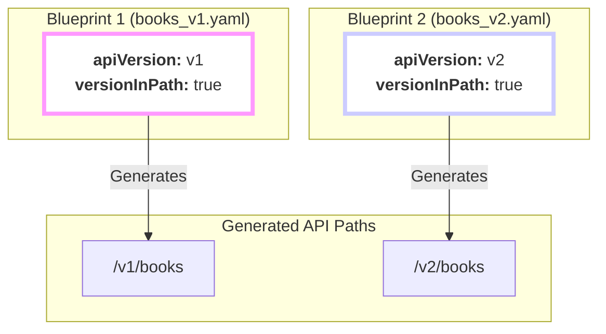

## The Never-Ending Story: API Evolution

Here's a fact of life: your API will change.

You'll add new features, rename fields for clarity, or rethink a data model. But what happens when you make a "breaking" change—a change that will cause existing applications using your API to fail?

This is the fundamental problem that API versioning solves. It provides a stable contract to your users, allowing you to release new, improved versions of your API **without breaking the old ones**.

In `firestone`, you declare this contract using the **required** `apiVersion` field in your resource blueprint.

```yaml
# This resource blueprint follows the 'v1' contract.
apiVersion: v1
```

## Strategy 1: The Quiet Update

By default, `apiVersion` simply acts as a label in your generated documentation. It's a clear signal to anyone reading the spec what version they are looking at, but it doesn't change the API's behavior or its URLs.

```yaml
kind: books
apiVersion: v2
```
This still generates the same path: `/books`. This strategy works well for internal APIs where you can coordinate updates across teams.

## Strategy 2: The Parallel Universe (URL Versioning)

For public APIs, you need something more robust. You need to run multiple versions of your API at the same time. `firestone` makes this easy with a second field: `versionInPath`.

When you combine `apiVersion` with `versionInPath: true`, you create a completely separate set of URLs for the new version.



Now, your old clients can continue using the stable `/v1/books` endpoints while new clients can take advantage of the shiny new `/v2/books` endpoints. No one breaks.

## Choosing a Version Name

The `apiVersion` string isn't just a random label; it should communicate stability and intent. Follow these conventions, which are common across the industry (and used by projects like Kubernetes).

| Stage | Format | Example | Meaning |
| :--- | :--- | :--- | :--- |
| **Alpha** | `v{N}alpha{I}` | `v1alpha1` | **Experimental.** Use for trying out new ideas. Unstable and may have breaking changes between iterations. |
| **Beta** | `v{N}beta{I}` | `v1beta1` | **Pre-release.** The feature is mostly complete and stable, but minor changes are still possible. Good for user testing. |
| **Stable** | `v{N}` | `v1` | **Production-Ready.** This is a stable, long-term release. Breaking changes MUST result in a new version (e.g., `v2`). |

**Pro-Tip:** For your very first release, just start with `apiVersion: v1`. You can always introduce alpha or beta versions later for *new features* within that `v1` contract.

## A Practical Example: Evolving the Books API

Let's walk through a migration.

### Step 1: The Original `v1`
We start with a simple `books` API. We'll set `versionInPath: true` because it will be a public API.

**`books.v1.yaml`**
```yaml
kind: books
apiVersion: v1
versionInPath: true
schema:
  type: array
  key: { name: book_id }
  items:
    properties:
      name: { type: string } # We called it 'name'
```
This generates endpoints at `/v1/books`. Life is good.

### Step 2: The Breaking Change
A few months later, we decide `name` is too generic. We want to change it to `title` for clarity. This is a **breaking change**. We can't just update the `v1` API.

### Step 3: Introducing `v2`
We create a new blueprint file for `v2`. We copy the `v1` file, update the `apiVersion` to `v2`, and make our change.

**`books.v2.yaml`**
```yaml
kind: books
apiVersion: v2
versionInPath: true
schema:
  type: array
  key: { name: book_id }
  items:
    properties:
      title: { type: string } # Renamed from 'name' to 'title'
```

### Step 4: Generate a Multi-Version API
Now, we tell `firestone` to generate a single API specification that includes **both** of our blueprints.

```bash
firestone generate \
    --resources books.v1.yaml,books.v2.yaml \
    openapi
```

The resulting OpenAPI specification will contain paths for both versions, allowing you to serve them simultaneously from the same API gateway:
- `/v1/books` (for existing clients, using the `name` field)
- `/v2/books` (for new clients, using the `title` field)

This is the power of declarative, parallel versioning.

## Formal Definition & Validation

| Rule | Description | Example Error |
| :--- | :--- | :--- |
| **Required** | You must always provide an `apiVersion` field. | `Validation Error: 'apiVersion' is a required property` |
| **Must be a string**| The value must be a string, not a number or other type. | `Validation Error: 1 is not of type 'string'` |
| **Cannot be empty** | The `apiVersion` string cannot be empty. | `Validation Error: '' is too short` |

---
## Next Steps

You've learned how to stamp a version on your API. Now, let's explore the powerful flag that controls how that version appears to your users.
- **Next:** Dive deep into the **[versionInPath](./version-in-path)** field.
- **Related:** Revisit the **[kind](./kind)** field to see how it combines with `apiVersion`.
