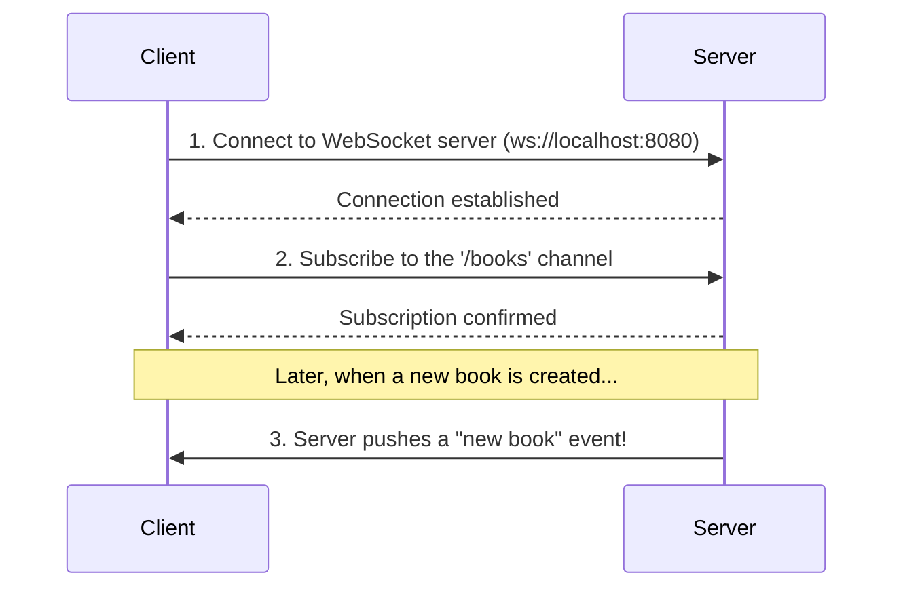

## A Different Kind of Conversation

So far, everything we've discussed has been about a **request-response** conversation. The client asks a question (`GET /books`), and the server gives an answer. It's a predictable, one-time exchange.

But what if you need the server to send updates to the client *without* being asked? What if you want real-time notifications, live dashboard updates, or a chat application?

This requires a different kind of conversation: a **subscription**.

-   **Request-Response (OpenAPI):** Like calling a pizza place. You call, you order, you get a pizza. The conversation is over.
-   **Subscription (AsyncAPI):** Like subscribing to a magazine. You sign up once, and then the publisher sends you a new issue every month without you having to ask again.

The **optional** `asyncapi` block in your `firestone` blueprint is how you define this subscription-based, event-driven part of your API. It uses the **[AsyncAPI](https://www.asyncapi.com/)** standard, which is a sister specification to OpenAPI, but designed for asynchronous communication like WebSockets.

## The Two Parts of a Subscription

Setting up a subscription in `firestone` has two main parts, just like signing up for a magazine.

### 1. The Mailing Address (`servers`)
First, you need to tell clients *where* to connect to subscribe. The `servers` block is a dictionary of your WebSocket server addresses.

```yaml
asyncapi:
  servers:
    # You can define multiple environments.
    dev:
      url: ws://localhost:8080 # The address for the dev server.
      protocol: ws # Use 'ws' for local, 'wss' for secure production.
      description: Development WebSocket server
```

### 2. The Topics (`channels`)
Next, you define *what* clients can subscribe to. These topics are called `channels`. `firestone` can automatically create channels that correspond to the three levels of your resource.

```yaml
asyncapi:
  # ... server definition from above
  channels:
    resources: true # A channel for events about the whole collection.
    instances: true # A channel for events about a single item.
```
By setting these to `true`, you create "newsletters" that clients can subscribe to.

## Visualizing a Subscription

This diagram shows how a client subscribes to the "new books" newsletter.



## A Practical Example: Real-Time Alerts

Let's see how REST and AsyncAPI can work together. Imagine an `alerts` resource. We want to create alerts via a standard REST endpoint, but we also want other services to be notified in real-time when a new alert is created.

**Resource Blueprint (`alerts.yaml`):**
```yaml
kind: alerts
apiVersion: v1

# Enable POST for creating alerts via REST.
methods:
  resource: [post]

# Define the WebSocket server and channel.
asyncapi:
  servers:
    event_bus:
      url: wss://events.example.com
      protocol: wss
  channels:
    resources: true # Create a channel for collection-level events.

schema:
  type: array
  key: { name: alert_id }
  items:
    properties:
      severity:
        type: string
        enum: [info, warning, critical]
      message:
        type: string
    required: [severity, message]
```

**How it Works:**
1.  **Service A** creates a new alert by making a standard HTTP request:
    `POST /alerts` with a body like `{"severity": "critical", "message": "CPU is on fire!"}`.
2.  **Service B** (and C, and D...) has already connected to `wss://events.example.com` and is listening to the `/alerts` channel.
3.  As soon as the `POST` request is processed, the server internally publishes an event to the `/alerts` channel.
4.  Service B, C, and D all instantly receive the new alert message (`{"severity": "critical", ...}`), allowing them to react in real-time.

---
## Congratulations!

You have now learned about all the major top-level building blocks of a `firestone` resource schema! You know how to:
- Name and version your resource (`kind`, `apiVersion`).
- Describe its purpose (`metadata`).
- Define its actions and security (`methods`, `security`).
- Define its data structure (`schema`).
- And now, how to add real-time capabilities (`asyncapi`).

You have all the tools you need to design a robust and well-documented API.

## Next Steps

With your blueprint complete, the next step is to learn how `firestone` uses it to generate different outputs.
- **Next:** Start with the most common output: **[OpenAPI Generation](../../generation-guides/openapi)**.
