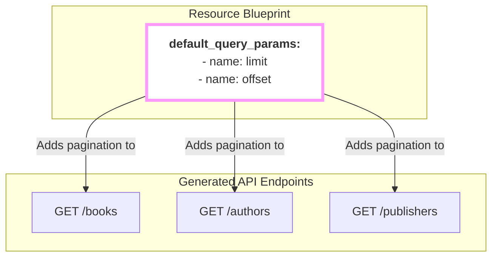

## Universal Tools for Every Collection

Imagine you're building a large API with many different resource collections: `/books`, `/authors`, `/publishers`, etc. For every single one of these collections, you'll probably want to provide your users with a few universal tools:

-   A way to view the data one page at a time (**Pagination**).
-   A way to sort the results (**Sorting**).
-   A way to change the response format (**Formatting**).

It would be repetitive to define parameters like `limit`, `offset`, and `sort` for every single resource. This is why `firestone` provides the **optional**, top-level `default_query_params` block. It's where you define these "universal tools" **once**, and they automatically become available on every relevant endpoint in your API.

```yaml
# These parameters are defined at the top level, outside the 'schema' block.
default_query_params:
  # ... your universal tools go here
kind: books
# ...
```

## The Most Important Recipe: Pagination

The most critical use case for `default_query_params` is pagination. Without it, a request like `GET /books` could try to return millions of records at once, overwhelming your server and the client.

Let's implement pagination using the standard `limit` and `offset` pattern.

-   **`limit`**: How many items to return per page.
-   **`offset`**: How many items to skip before starting the page.

Here is a robust pagination definition:
```yaml
default_query_params:
  - name: limit
    description: "Maximum number of results to return per page."
    schema:
      type: integer
      minimum: 1      # Must request at least 1 item.
      maximum: 100    # Protect our server from abuse!
    default: 20       # If the user doesn't specify, default to 20.

  - name: offset
    description: "Number of results to skip for pagination."
    schema:
      type: integer
      minimum: 0      # Cannot have a negative offset.
    default: 0
```
By defining this at the top level of your blueprint, you've just added pagination to your entire API. A user can now make safe, paginated requests like `GET /books?limit=10&offset=20`.

## Visualizing the "Default" Behavior

The power of this block is that it applies *everywhere*. If you define `limit` and `offset` here, they become available on the list endpoints for all your resources.



## Universal vs. Specific Questions (A Recap)

It's important to remember the difference between the two places you can define query parameters.

| | `default_query_params` | `schema.query_params` |
| :--- | :--- | :--- |
| **Analogy** | **Universal Tools** | **Specific Questions** |
| **Scope** | Applies to **all** resources. | Applies **only** to the current resource. |
| **Location**| **Top-level** of the blueprint. | **Inside** the `schema` block. |
| **Use Case** | Pagination (`limit`, `offset`), Sorting (`sort_by`), Formatting (`format`). | Filtering by data fields (`genre=scifi`, `author=Asimov`). |

You use both together to create a powerful and flexible API. A user could make a request that uses both universal and specific parameters:
`GET /books?limit=10&genre=scifi`

---
## Next Steps

You've now learned about all the major building blocks for defining a resource, from its name and actions to its data structure and security. The final piece of the puzzle is how to handle real-time, event-driven features.
- **Next:** Explore how to define WebSocket channels with the **[asyncapi](./asyncapi)** block.