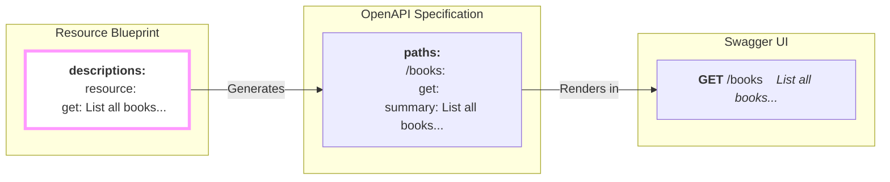

## Helpful Signs for Your API

You've defined your resource, its actions (`methods`), and its security. Your API is functional, but is it *friendly*? When a developer looks at your documentation, how do they know what each operation *really* does?

While the main `metadata` block describes your resource as a whole, the **optional** `descriptions` block lets you put a helpful, human-readable "sign" on the door of each specific endpoint.

## Before and After: The Power of Good Signs

Without a `descriptions` block, `firestone` provides generic, default signs. They're functional, but not very helpful.

#### Before `descriptions`
- `GET /books` → "Get all books"
- `POST /books` → "Create a book"

Now, let's add a `descriptions` block to provide more context.

```yaml
descriptions:
  resource:
    get: "List all books in the catalog, sorted by title."
    post: "Add a new book to the library. A unique book_id will be auto-generated."
  instance:
    get: "Retrieve a single book by its unique book_id."
```

#### After `descriptions`
- `GET /books` → "List all books in the catalog, sorted by title."
- `POST /books` → "Add a new book to the library. A unique book_id will be auto-generated."

The "After" version is infinitely more useful. It tells the user about the default sorting and clarifies that the `book_id` is handled automatically. This is the power of good descriptions.

## From Blueprint to Helpful UI

The descriptions you write are automatically placed in the `summary` field for each operation in your generated OpenAPI specification. This is what documentation tools like Swagger UI use to label your endpoints.



## A Sign Painter's Guide: Writing Good Descriptions

Follow these simple tips to write effective, helpful descriptions.

### 1. Be Action-Oriented
Start with a verb that describes what the operation does.

| ✅ Good | ❌ Vague |
| :--- | :--- |
| `get: "List all tasks sorted by due date."` | `get: "Gets tasks."` |
| `post: "Create a new user account."` | `post: "New user."` |

### 2. Include Key Details and Side-Effects
If an operation has an important side-effect, mention it! This is crucial for building trust with your users.

```yaml
# Good: The user knows what to expect.
post: "Create a new user and send a welcome email."
delete: "Permanently delete this user and all their associated data."
```

### 3. Use a Consistent Voice
Use the same grammatical voice (e.g., imperative) for all your descriptions. It makes the whole API feel more coherent.

```yaml
# ✅ Consistent Imperative Voice
get: "List all books."
post: "Create a new book."
delete: "Delete a specific book."
```

## A Complete Example

Here is a `descriptions` block in context, providing signs for both the `resource` (collection) and `instance` (single item) levels.

```yaml
kind: tasks
apiVersion: v1
methods:
  resource: [get, post]
  instance: [get, put, delete]

descriptions:
  resource:
    get: "List all tasks, optionally filtered by status or assignee."
    post: "Create a new task. A unique task_id will be returned."
  instance:
    get: "Get the full details for a specific task by its ID."
    put: "Update a task's properties, such as its status or due date."
    delete: "Permanently delete a task. This action cannot be undone."
```

---
## Next Steps

You've learned to add specific descriptions to each operation. But what about parameters that apply to *all* operations, like for pagination or sorting?
- **Next:** Learn how to define universal parameters with **[default_query_params](./default-query-params)**.
