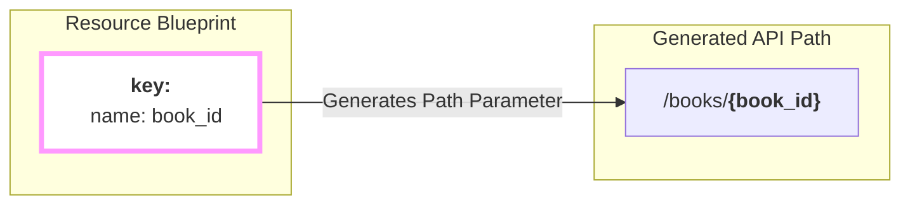

## The Key to a Single Item

You've defined the structure for your collection of items. But how do you target just **one** of them? How do you generate a path like `/books/123-abc` to get, update, or delete a single book?

This is the job of the **required** `key` block. It tells `firestone` which field in your data model acts as the **unique identifier**, or "primary key," for a single item.

```yaml
schema:
  type: array
  items:
    # ... your properties
  key:
    # The key block defines the unique ID.
```

## Anatomy of the `key` Block

The `key` block is an object with two fields:

-   **`name`**: The name of the identifier field. This is the name that will be used in the URL path.
-   **`schema`**: A JSON Schema definition for the key itself. This is where you define its type (e.g., `string` or `integer`) and format (e.g., `uuid`).

## A Practical Example

Let's add a `key` to our `books` resource. We'll decide that each book will be identified by a UUID.

```yaml
schema:
  type: array
  items:
    properties:
      book_id:
        type: string
        format: uuid
      title:
        type: string
      author:
        type: string
    required:
      - book_id
      - title

  # Define the key for a single book.
  key:
    name: book_id
    description: The unique UUID for this book.
    schema:
      type: string
      format: uuid
```

Here, we've told `firestone` that the `book_id` field is the unique identifier for a book.

## Visualizing the Result

The `name` you provide in the `key` block is used to generate the path parameter for all `instance` and `instance_attrs` endpoints.



Because we defined the `key`'s name as `book_id`, `firestone` now knows how to construct the correct URL for fetching a single item.

## Choosing a Good Key

-   **UUIDs are a great choice:** Universally Unique Identifiers (`uuid`) are a standard and robust way to identify resources. Using `type: string` and `format: uuid` is a very common pattern.
-   **Integers work too:** If you are using auto-incrementing IDs from a database, `type: integer` is perfectly acceptable.
-   **The `key` field must be one of your properties:** The `name` in your `key` block should match one of the fields defined under `items.properties`.
-   **It must be required:** You should always include your key field in the `required` array within `items`. A resource instance without its unique key doesn't make sense.

---
## Next Steps

You now know how to define your resource's fields and its unique identifier. But what if you want to give your users a way to filter or search the collection?
- **Next:** Learn how to add filtering capabilities with **[query_params](./query-params)**.
