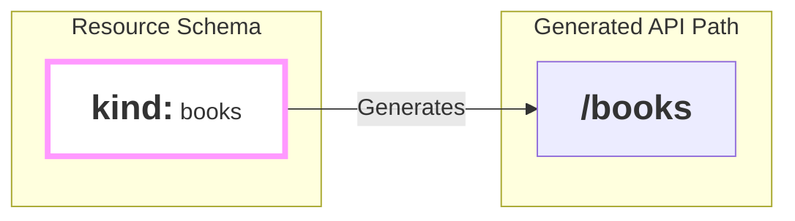

## What is a `kind`?

Every resource you define needs an identity. The `kind` field is its name. It's the most fundamental piece of your resource blueprint, answering the question, "What *kind* of thing is this?"

Think of it as the **noun** of your API. Is it a `book`? A `user`? An `invoice`?

```yaml
# This resource is a collection of books.
kind: books
```

This simple, **required** field is the seed from which `firestone` grows your entire API. It dictates the URL paths, the names of CLI commands, and how the resource is tagged in documentation.

## From `kind` to API Path

The most immediate and important job of the `kind` field is to define the base path for your API's endpoints. `firestone` takes the value of `kind` and puts it directly into the URL.



Let's see this with a full example.

**If your resource schema is:**
```yaml
kind: books
apiVersion: v1
methods:
  resource: [get]
  instance: [get]
schema:
  type: array
  key:
    name: book_id
    schema: {type: string}
  items:
    type: object
    properties:
      title: {type: string}
```

**`firestone` generates these API paths:**
- `/books` (for the whole collection)
- `/books/{book_id}` (for a single instance)

The `kind` directly created the `/books` part of the URL, giving your API a clean, predictable structure.

## Choosing a Good `kind`

Since the `kind` is so important for URLs and generated code, there are a few best practices to follow.

### 1. Use Plurals for Collections
Most resources represent a *collection* of items (a list of books, a group of users). For these, you should always use the **plural** form for your `kind`.

| ✅ Good (Plural) | ❌ Less Good (Singular) |
| :--- | :--- |
| `kind: books` | `kind: book` |
| `kind: users` | `kind: user` |
| `kind: invoices` | `kind: invoice` |

**Why?** It follows RESTful API design conventions. A request to `GET /books` intuitively means "get me the list of all books," which is clearer than `GET /book`.

### 2. Use `snake_case` or `camelCase` for Multiple Words
If your resource name has multiple words, you have two good options. The key is to be consistent!

-   **`snake_case` (Recommended):** `address_book`, `dns_records`
-   **`camelCase`:** `addressBook`, `dnsRecords`

**Why not hyphens?** Avoid using hyphens (`address-book`). While they work in URLs, they are often invalid characters for identifiers in generated code (like Python function names or JavaScript object keys), which can cause problems down the line.

### 3. Keep it Simple
Your `kind` should only contain:
-   Lowercase letters (`a-z`)
-   Numbers (`0-9`)
-   Underscores (`_`)

Avoid spaces, uppercase letters, and special characters. `firestone` will try to sanitize them for URLs, but sticking to these simple rules will prevent unexpected behavior.

## `kind` Throughout the Ecosystem

The influence of `kind` goes far beyond just the API path. It's used everywhere as the primary identifier for your resource.

-   **OpenAPI Tags:** In Swagger UI, your API endpoints will be grouped together under a tag matching the `kind`.
-   **CLI Commands:** The generated CLI will use the `kind` to create subcommands. `kind: books` creates `my-cli books list`, `my-cli books get`, etc.
-   **Documentation:** Titles, descriptions, and help text will all reference the `kind`.
-   **Generated Code:** Variable names and function names in generated clients will often be based on the `kind`.

## Formal Definition & Validation

`firestone` enforces a few simple rules for the `kind` field.

| Rule | Description | Example Error |
| :--- | :--- | :--- |
| **Required** | You must always provide a `kind` field. | `Validation Error: 'kind' is a required property` |
| **Must be a string** | The value must be a string, not a number or other type. | `Validation Error: 123 is not of type 'string'` |
| **Cannot be empty** | The `kind` string cannot be empty. | `Validation Error: '' is too short` |

---

## Next Steps

Now that you've given your resource an identity, it's time to give it a version.
- **Next:** Learn about the **[apiVersion](./apiversion)** field.
- **Related:** See how `kind` interacts with **[versionInPath](version-in-path.md)** to create versioned URLs.

