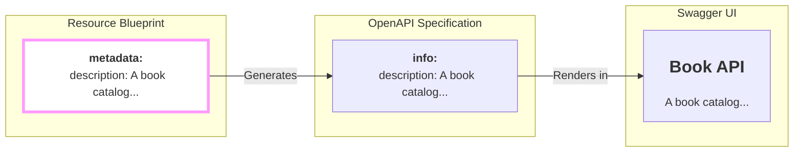

## What's This For, Anyway?

So far, you've given your resource an identity (`kind`) and a version (`apiVersion`). A computer can understand that, but what about the humans who will use your API? What does a `books` API *do*? What is its purpose?

This is where the **optional** `metadata` block comes in. It's the docstring for your entire resource, allowing you to write a human-readable story for your API.

```yaml
metadata:
  description: A collection of books in the library catalog.
```

This description is your chance to communicate the "why" behind your API to other developers, your future self, and anyone who looks at your generated documentation.

## From Blueprint to Human-Friendly Docs

The description you write in the `metadata` block doesn't just sit there. `firestone` automatically weaves it into your generated API specifications, where it becomes the primary documentation for your resource.



This direct pipeline from your blueprint to the final documentation is a core principle of `firestone`. It ensures your documentation is never out of sync with your design.

## The Art of a Good Description

A good description is a small investment that pays huge dividends in usability. Here are some tips.

### 1. Be Concise, but Descriptive
A single, clear sentence is often enough.

| ✅ Good | ❌ Too Vague |
| :--- | :--- |
| `description: Manages customer orders and fulfillment.` | `description: Orders.` |

### 2. Describe the "What," Not the "How"
Focus on the resource's purpose, not its technical implementation. The generated spec will handle the technical details.

| ✅ Good | ❌ Unnecessary Detail |
| :--- | :--- |
| `description: A catalog of products with price and inventory.` | `description: A RESTful API for products.` |

### 3. Use YAML Multi-line Strings for Detail
For more complex resources, use YAML's `|` character to write a clear, multi-line description without sacrificing readability in your blueprint file.

```yaml
metadata:
  description: |
    Manages the e-commerce order lifecycle.

    Handles everything from cart creation and payment processing
    to inventory allocation and shipping coordination.
```

This will be rendered as a multi-paragraph description in your documentation, giving your users valuable context.

## Formal Definition

The `metadata` block is an optional object that currently contains one field.

| Field | Type | Required | Description |
| :--- | :--- | :--- | :--- |
| `description` | `string` | No | A human-readable summary of the resource's purpose. |

---
## Next Steps

You've named your resource, given it a version, and described its purpose. Now it's time to define what a user can actually *do* with it.
- **Next:** Learn how to configure API operations with the **[methods](./methods)** block.
