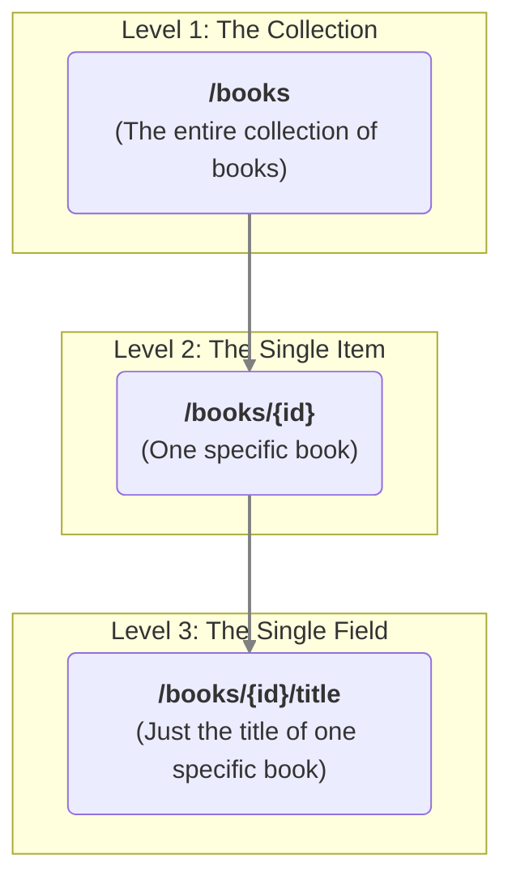

## The Verbs of Your API

You've defined the *noun* of your API (`kind: books`), but what about the *verbs*? What can a user actually **do** with the books in your collection?

- Can they **read** the list of books?
- Can they **create** a new one?
- Can they **update** an existing one?
- Can they **delete** one?

These actions are represented by standard **HTTP methods**. You've likely seen them before: `GET`, `POST`, `PUT`, `DELETE`. They are the universal verbs of the web.

The `methods` block in your `firestone` blueprint is your control panel. It's where you explicitly state which verbs are allowed for your resource, giving you complete control over your API's behavior.

## The Three Levels of Action

In a typical RESTful API, actions don't just apply to the resource as a whole; they can be applied at different levels of granularity. `firestone` understands three distinct levels.



The `methods` block allows you to assign verbs to each of these levels:
- `resource`: Methods that apply to the whole collection (Level 1).
- `instance`: Methods that apply to a single item (Level 2).
- `instance_attrs`: Methods that apply to a single field of a single item (Level 3).

## The `methods` Block: Your Control Panel

Let's see how this looks in practice. The `methods` block is an **optional** object where you list the allowed verbs for each level.

```yaml
methods:
  # Verbs for the '/books' collection path
  resource: [get, post]

  # Verbs for the '/books/{id}' item path
  instance: [get, put, delete]

  # Verbs for the '/books/{id}/title' field path
  instance_attrs: [get]
```

By defining this, you are telling `firestone` exactly which API endpoints to generate. Anything not in this list will not be created.

**What if I omit the `methods` block?**
If you don't include a `methods` block at all, `firestone` assumes you want a standard, full-CRUD (Create, Read, Update, Delete) resource and enables a default set of common methods for the `resource` and `instance` levels. The `instance_attrs` level is disabled by default.

## Common Recipes

This level of control allows you to craft your API for specific purposes. Here are a few common "recipes."

### Recipe 1: The Read-Only API
Perfect for reference data, like a list of countries or a product catalog that's managed elsewhere.

```yaml
# Users can only read the data; they cannot change it.
methods:
  resource: [get]
  instance: [get]
```
**Generated Endpoints:**
- `GET /countries` (List all countries)
- `GET /countries/{id}` (Get a single country)
- All other methods (`POST`, `PUT`, `DELETE`) are disabled.

### Recipe 2: The Append-Only API
Ideal for things like audit logs or event streams, where data should be added but never changed or deleted.

```yaml
# Users can create new log entries and read them, but cannot modify or delete them.
methods:
  resource: [post] # Create new log entries
  instance: [get]    # Read a specific log entry
```
**Generated Endpoints:**
- `POST /logs` (Add a new log)
- `GET /logs/{id}` (View a specific log)
- `PUT` and `DELETE` are disabled, preserving the integrity of the log.

### Recipe 3: The Full-CRUD API
This is the default behavior if you omit the `methods` block, but being explicit is often clearer.

```yaml
# Users have full control to create, read, update, and delete.
methods:
  resource: [get, post]
  instance: [get, put, delete]
  instance_attrs: [] # Explicitly disable field-level access
```

## The Reference Manual

For when you need to know every possible verb for every level, here is the complete reference.

### `resource` Methods (The Collection)
Applied to collection endpoints like `/books`.

| Method | Operation | Example Use |
|:--- |:--- |:--- |
| `get` | List resources | Get all books |
| `post` | Create resource | Add a new book |
| `delete`| Delete collection | Delete *all* books (use with caution!) |
| `head` | Check existence | See if the collection exists |
| `patch` | Bulk update | Update multiple books at once |

### `instance` Methods (The Single Item)
Applied to individual item endpoints like `/books/{book_id}`.

| Method | Operation | Example Use |
|:--- |:--- |:--- |
| `get` | Retrieve item | Get one specific book |
| `put` | Update/replace item | Replace a book's data |
| `delete`| Delete item | Remove a specific book |
| `head` | Check existence | See if a specific book exists |
| `patch` | Partial update | Update a few of a book's fields |

### `instance_attrs` Methods (The Single Field)
Applied to attribute endpoints like `/books/{book_id}/title`. These are only generated if this list is not empty.

| Method | Operation | Example Use |
|:--- |:--- |:--- |
| `get` | Get attribute | Read just the book's title |
| `put` | Update attribute | Change the book's title |
| `delete`| Clear attribute | Remove the book's title |
| `head` | Check attribute | See if the book has a title |

---
## Next Steps

You have now defined the name, version, description, and actions for your resource. The final, most important piece of the puzzle is defining the data itself.
- **Next:** Dive into the heart of the blueprint with the **[schema](./schema)** block.