## Asking Questions About Your Collection

You've defined a collection of resources. For our `books` example, a `GET /books` request would return *every single book* in the library. But what if a user wants to ask a more specific question?

- "Can I see only the **science fiction** books?"
- "Show me books by **Isaac Asimov**."
- "Are there any books published **after 2020**?"

This is where **query parameters** come in. They are the `?key=value` pairs you see at the end of URLs, and they are the standard way for an API user to filter, sort, and paginate a collection.

The `query_params` block in your `firestone` blueprint is where you define **which questions your users are allowed to ask**.

```yaml
schema:
  # ... key and items definitions
  query_params:
    # Define your allowed questions here
```

## Anatomy of a Question

The `query_params` block is an array, where each item in the array defines one allowed question. Each question you define has a few key parts:

-   **`name`**: The name of the parameter in the URL (the `key` in `?key=value`).
-   **`description`**: A human-readable explanation of what the parameter does.
-   **`schema`**: A JSON Schema defining the type and validation rules for the parameter's value.

### A Practical Example: Filtering by Genre

Let's allow users to ask for books of a specific genre.

```yaml
schema:
  query_params:
    - name: genre
      description: Filter books by a specific genre.
      schema:
        type: string
        enum: [fiction, nonfiction, mystery, scifi] # The value must be one of these
```

By adding this block, you've just enabled a new capability in your API. Users can now make a request like this:

`GET /books?genre=scifi`

...and your API will know that the user is asking for science fiction books.

## From Blueprint to Interactive Filter

Like everything else in `firestone`, the `query_params` you define are automatically translated into user-friendly documentation.

```mermaid
graph LR
    subgraph "Resource Blueprint"
        A["<b>query_params:</b><br/>&nbsp;&nbsp;- name: genre<br/>&nbsp;&nbsp;&nbsp;&nbsp;schema:<br/>&nbsp;&nbsp;&nbsp;&nbsp;&nbsp;&nbsp;type: string"]
    end

    subgraph "OpenAPI Specification"
        B["<b>parameters:</b><br/>&nbsp;&nbsp;- name: genre<br/>&nbsp;&nbsp;&nbsp;&nbsp;in: query"]
    end

    subgraph "Swagger UI"
        C["<label>genre</label><input placeholder='fiction' />"]
    end

    A -- Generates --> B -- Renders in --> C;

    style A fill:#FFF,stroke:#f9f,stroke-width:4px
```


This creates an interactive filter right in your Swagger UI documentation, making your API easier to explore and test.

## Common Recipes for Questions

Here are a few common types of questions you can enable with `query_params`.

### Recipe 1: Filtering by a Field
This is the most common use case, as seen in our `genre` example. You simply define a parameter that matches a field on your resource.

```yaml
query_params:
  - name: author
    description: Filter by the author's last name.
    schema:
      type: string
```
**Usage:** `GET /books?author=Asimov`

### Recipe 2: Filtering by a Date Range
Let users find resources created within a certain time window.

```yaml
query_params:
  - name: published_after
    description: "Show books published after this date (ISO 8601)."
    schema:
      type: string
      format: date
  - name: published_before
    description: "Show books published before this date (ISO 8601)."
    schema:
      type: string
      format: date
```
**Usage:** `GET /books?published_after=2020-01-01`

### Recipe 3: Full-Text Search
Provide a generic search parameter. Your API server's implementation would then handle searching across multiple fields.

```yaml
query_params:
  - name: q
    description: "A generic query string to search for in the book's title and description."
    schema:
      type: string
```
**Usage:** `GET /books?q=robot`

## Specific vs. Universal Questions

`firestone` has two different places where you can define query parameters, and it's important to understand the difference.

| | `schema.query_params` | `default_query_params` |
| :--- | :--- | :--- |
| **Scope** | **Specific** to this resource. | **Universal** across all resources. |
| **Location**| Inside the `schema` block. | At the top level of the blueprint. |
| **Use Case** | Filtering by resource fields (`author`, `status`). | Cross-cutting concerns (`limit`, `offset`, `sort`). |

Think of it this way:
- **`query_params`** are for questions about the *data itself* (e.g., "What genre is the book?").
- **`default_query_params`** are for questions about the *request/response* (e.g., "How many books should I get?").

---
## Next Steps

You now have a powerful way to define your resource and allow users to query it. The next step is to ensure that only authorized users can perform certain actions.
- **Next:** Learn how to lock down your API with the **[security](./security)** block.
- **Related:** Learn about universal parameters in **[default_query_params](./default-query-params)**.
