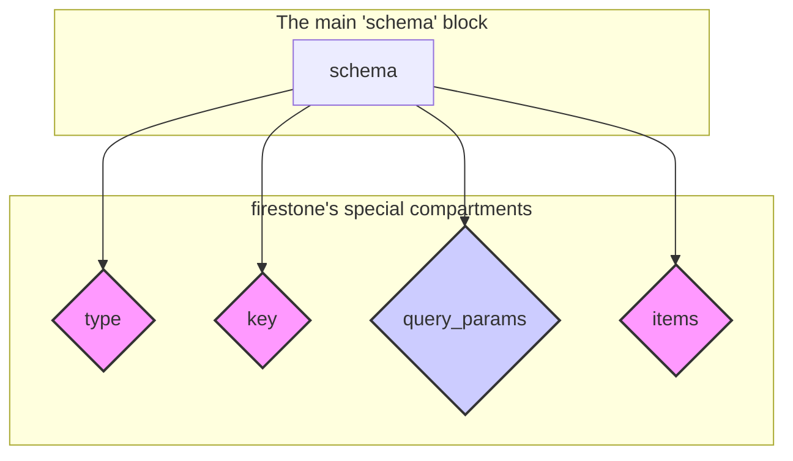

## The Heart of the Blueprint

You've defined your resource's name, version, and what it can do. Now we arrive at the most important part: **What *is* it?**

The **required** `schema` block is the heart of your `firestone` blueprint. It's where you define the actual data structure of your resource. What fields does it have? What are their data types? What are the validation rules?

```yaml
# The schema block defines the data model for your resource.
schema:
  # ... data definition goes here
```

## Standing on the Shoulders of Giants: JSON Schema

`firestone` doesn't reinvent the wheel for data modeling. Instead, it uses the power of **[JSON Schema](https://json-schema.org/)**, a mature, industry-standard vocabulary for defining and validating JSON data.

**This is a powerful concept.** It means:
- Any knowledge you have of JSON Schema is directly applicable in `firestone`.
- You can leverage a rich ecosystem of existing tools for validating and working with your schemas.
- You have access to a huge range of features for defining data types, validation rules, and complex structures.

While `firestone` uses JSON Schema to define the fields themselves (like `title` or `author`), it organizes the overall `schema` block into a few key, `firestone`-specific sections.

## Anatomy of the `schema` Block

Think of the `schema` block as a container with a few special compartments for organizing your definition.



Here's a quick tour of these compartments:

- **`type`**: Defines the collection type. For now, this is always `array`, as `firestone` is designed to manage collections of resources.
- **`key`**: Defines the **unique identifier** for a single item in the collection (e.g., the `book_id`). This is crucial for generating paths like `/books/{book_id}`.
- **`query_params`** (optional): Allows you to define resource-specific filters, like `/books?author=George+Orwell`.
- **`items`**: This is where the real magic happens. The `items` block contains the pure **JSON Schema definition** for a single item in your collection. You'll define all your data fields—like `title`, `author`, and `isbn`—inside this block.

## A Complete Blueprint: The Book Resource

Let's look at a complete `schema` block for our `books` resource. See if you can spot the four compartments we just discussed.

```yaml
schema:
  # 1. The 'type' is 'array' because this is a collection of books.
  type: array

  # 2. The 'key' defines the unique ID for a single book.
  key:
    name: book_id
    description: A unique identifier for each book
    schema:
      type: string
      format: uuid

  # 3. 'query_params' allows filtering the collection, e.g., GET /books?genre=fiction
  query_params:
    - name: genre
      description: Filter by genre
      schema:
        type: string
        enum: [fiction, nonfiction, mystery, scifi]

  # 4. 'items' contains the JSON Schema definition for one book.
  items:
    type: object
    properties:
      # These are the fields of a single book, defined using standard JSON Schema.
      title:
        type: string
        description: Book title
        minLength: 1

      author:
        type: string
        description: Author's name

      isbn:
        type: string
        description: ISBN-13 identifier
        pattern: '^978-\d{10}$' # Uses a regex for validation!

      published_year:
        type: integer
        minimum: 1000

      tags:
        type: array
        items:
          type: string

    # 'required' is a standard JSON Schema keyword.
    required:
      - title
      - author
      - isbn
```
This single, declarative block gives `firestone` everything it needs to generate rich API documentation, a powerful CLI, and robust server-side validation.

---
## Next Steps

You've seen the overall structure of the `schema` block. Now, let's dive into each compartment, starting with the most important one: defining the fields of your resource.
- **Next:** Learn how to define your resource's data fields in the **[items](./items/)** block.
- **Related:** Understand how `firestone` identifies unique items with the **[key](./key/)** block.