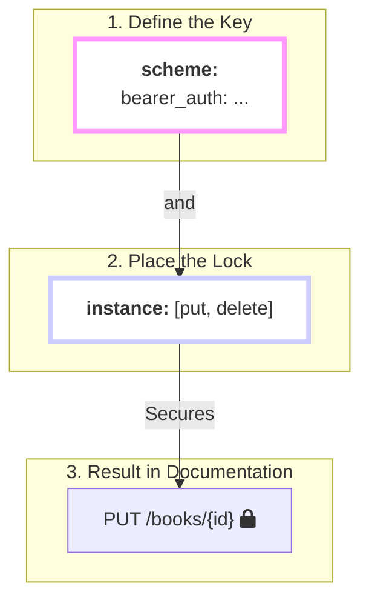

## Who Can Do What?

You've defined your resource and the actions (or "verbs") that can be performed on it. But who is allowed to perform them? Should anyone be able to delete a book, or should that be restricted to administrators?

The **optional** `security` block is how you answer this crucial question. It's your tool for putting locks on your API's doors, ensuring that only users with the right key can perform sensitive operations.

## The Lock and Key Model

`firestone`'s approach to security is best explained with a simple "lock and key" analogy. It's a two-step process:

1.  **Define Your Keys (`scheme`):** First, you decide what *kind* of keys your API will accept. This is done in the `scheme` block.
2.  **Place Your Locks (`resource`, `instance`):** Second, you decide which doors get a lock. You do this by listing the methods that should be protected.

### Step 1: Define Your Keys (`scheme`)
The `scheme` block is a dictionary where you give a name to each authentication method you want to support.

| The "Key" | `firestone` Scheme | Use Case |
| :--- | :--- | :--- |
| **A temporary keycard** | `http` with `bearer` | The modern standard. Users log in to get a temporary (JWT) token they present with each request. |
| **A physical key** | `apiKey` | For server-to-server communication. Each client gets a long-lived key. |
| **A password** | `http` with `basic` | Simple username/password authentication. Good for internal tools. |

Here's how you'd define a standard JWT Bearer token scheme:
```yaml
security:
  scheme:
    # We're naming our key 'bearer_auth'. You can choose any name.
    bearer_auth:
      type: http
      scheme: bearer
      bearerFormat: JWT
```

### Step 2: Place Your Locks
Once you've defined your keys, you simply list the methods you want to protect at the `resource` or `instance` level.

```yaml
security:
  # ... your scheme definition from above
  
  # Place locks on these resource-level methods
  resource: [post] # Lock the door for creating new books.

  # Place locks on these instance-level methods
  instance: [put, delete] # Lock the doors for updating and deleting a single book.
```
Any method you *don't* list remains public and requires no key.

## Visualizing the Process

Here's how the two steps come together to secure an endpoint in your generated documentation.


`firestone` sees that the `put` method is in the `instance` security list and automatically adds the security requirement (the lock) to that endpoint in the generated OpenAPI spec.

## A Common Recipe: Public Reads, Private Writes

The most common security pattern is to allow anyone to read your data, but require authentication for anyone trying to change it.

Here is the complete `security` block for this recipe:
```yaml
security:
  # First, define the type of key we accept.
  scheme:
    bearer_auth:
      type: http
      scheme: bearer
      bearerFormat: JWT

  # Next, apply locks only to the methods that change data.
  resource:
    - post    # Protects POST /books

  instance:
    - put     # Protects PUT /books/{id}
    - patch   # Protects PATCH /books/{id}
    - delete  # Protects DELETE /books/{id}
```
With this configuration:
- `GET /books` and `GET /books/{id}` are **public**.
- `POST`, `PUT`, `PATCH`, and `DELETE` are **protected** and will require a valid Bearer token.

## The Locksmith's Manual

While the "Bearer" key is most common, `firestone` supports several scheme types, corresponding directly to the OpenAPI 3.0 specification.

| `type` | `scheme` / `in` / `name` | Use Case |
| :--- | :--- | :--- |
| `http` | `scheme: bearer` | JWT or other token-based auth. |
| `http` | `scheme: basic` | Standard username/password auth. |
| `apiKey`| `in: header`<br/>`name: X-API-KEY`| API key passed in a custom header. |
| `apiKey`| `in: query`<br/>`name: api_key` | API key passed as a query parameter. |
| `oauth2` | (See OpenAPI docs) | Standard OAuth2 flows. |
| `openIdConnect` | (See OpenAPI docs) | OIDC authentication flows. |

---
## Next Steps
You've learned how to define and secure the actions for your resource. Now, let's see how you can provide custom descriptions for those actions to make your API even clearer.
- **Next:** Learn how to add operation-specific documentation with the **[descriptions](./descriptions)** block.
