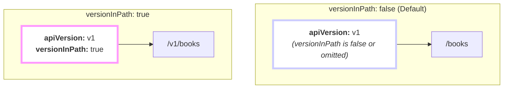

## The On/Off Switch for URL Versioning

In the previous section on `apiVersion`, you learned how to create parallel, versioned APIs. The `versionInPath` field is the simple on/off switch that makes it happen.

It's an **optional** boolean field that answers one question: "Should the version string from `apiVersion` be included in the URL path?"

-   `versionInPath: true` → Yes, put the version in the URL.
-   `versionInPath: false` (or omitted) → No, keep the URL clean.

## Visualizing the Difference

The effect of this one field is best understood visually. Let's assume you have a resource with `kind: books` and `apiVersion: v1`.



As you can see, setting `versionInPath: true` prepends the version string directly to the URL path, creating a distinct, versioned endpoint.

## When Should I Use It? A Simple Guide

Choosing `true` or `false` depends on who will be using your API.

### Use `versionInPath: true` for...
**Public or External APIs.** If your API is consumed by third parties, mobile apps, or frontend web applications that you don't control directly, you should almost always use path versioning.

**Why?** It provides a stable, explicit contract. Your consumers are guaranteed that `/v1/books` will not change in a breaking way. When you release `v2`, they can migrate on their own schedule without their apps breaking.

```yaml
# A public-facing API for products
kind: products
apiVersion: v1
versionInPath: true # ✅ Correct for external consumers
```

### Use `versionInPath: false` for...
**Internal APIs and Microservices.** If your API is only used by other services that you control, you can often skip path versioning.

**Why?** You can coordinate deployments. When a breaking change is made, you can update both the API provider and the API consumer at the same time. This keeps your internal URLs clean and simple.

```yaml
# An internal service for managing user sessions
kind: user_sessions
apiVersion: v1
versionInPath: false # ✅ Correct for internal services
```

## A Complete Example

Here is a full resource blueprint demonstrating how `versionInPath` works with `kind` and `apiVersion` to construct the final URL paths.

**Resource Blueprint:**
```yaml
kind: products
apiVersion: v2
versionInPath: true # We are explicitly turning on path versioning

schema:
  type: array
  key:
    name: product_id
  items:
    type: object
    properties:
      name: { type: string }
      price: { type: number }
```

**Generated API Paths:**
-   `/v2/products`
-   `/v2/products/{product_id}`

The path is constructed as `/{apiVersion}/{kind}`.

## Formal Definition

| | |
| :--- | :--- |
| **Type** | `boolean` |
| **Required** | No |
| **Default** | `false` |

If you omit the `versionInPath` field entirely, it is treated as `false`.

---
## Next Steps

You've now learned how to name, version, and structure the URLs for your resource. Next, you'll see how to add descriptive information to your generated documentation.
- **Next:** Learn about the **[metadata](./metadata)** field.
- **Related:** Revisit **[apiVersion](./apiversion)** to see how the version string is defined.
