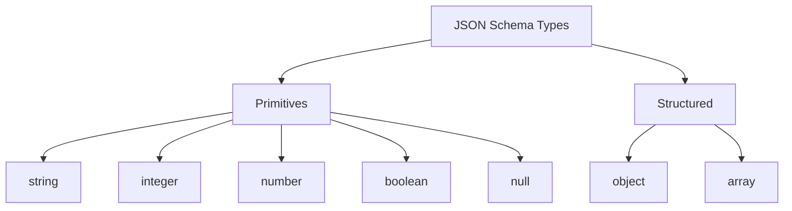

## Overview

Firestone uses JSON Schema to define resources, but understanding how different schema types translate to API behavior is crucial for effective resource design.

This guide explains:
- How `type` affects API generation
- Collection (array) vs singleton resources
- Nested objects and arrays
- Type constraints and validation
- Best practices for choosing types

## The Type Hierarchy

JSON Schema supports these primitive types:



Firestone primarily works with **array** (for collections) containing **object** items (for resources).

## Collection Resources (array)

Most firestone resources are collections defined with `type: array`:

```yaml
kind: books
schema:
  type: array
  key:
    name: book_id
    schema:
      type: string
  items:
    type: object
    properties:
      title:
        type: string
      author:
        type: string
```

### What This Generates

**OpenAPI Endpoints:**

```
GET    /books            # Returns array of books
POST   /books            # Creates a book, returns single book
GET    /books/{book_id}  # Returns single book
PUT    /books/{book_id}  # Updates a book, returns single book
DELETE /books/{book_id}  # Deletes a book, returns 204
```

**Request/Response Schemas:**

```yaml
# GET /books response
type: array
items:
  $ref: '#/components/schemas/Book'

# POST /books request body
$ref: '#/components/schemas/CreateBook'

# GET /books/{book_id} response
$ref: '#/components/schemas/Book'
```

### Key Requirements

For `type: array` resources:

1. **Must have a `key`** - Defines the unique identifier
2. **Must have `items`** - Defines the resource structure
3. **`items.type` should be `object`** - For structured resources

**Example:**

```yaml
schema:
  type: array
  key:
    name: book_id          # The identifier
    description: Unique book ID
    schema:
      type: string         # Key type
  items:
    type: object          # Resource is an object
    properties:
      # ... fields ...
```

## Object Resources

Each item in a collection is typically an object:

```yaml
items:
  type: object
  properties:
    title:
      type: string
    year:
      type: integer
    available:
      type: boolean
  required:
    - title
```

### Properties

Objects have **properties**, where each property has:

```yaml
property_name:
  type: <type>           # Required: data type
  description: <text>    # Recommended: documentation
  # Optional constraints:
  enum: [...]           # Allowed values
  default: <value>      # Default value
  minimum: <num>        # Min value (numbers)
  maximum: <num>        # Max value (numbers)
  minLength: <num>      # Min length (strings)
  maxLength: <num>      # Max length (strings)
  pattern: <regex>      # Regex pattern (strings)
```

### Required Fields

The `required` array lists fields that must be provided:

```yaml
items:
  type: object
  properties:
    title:
      type: string
    author:
      type: string
    isbn:
      type: string
  required:
    - title    # Must provide title
    - author   # Must provide author
    # isbn is optional
```

**Effect on generation:**

- **POST /books** - Request schema requires title and author
- **PUT /books/{id}** - Request schema requires title and author
- **GET /books/{id}** - Response always includes all fields

## Primitive Types

### String

The most common type:

```yaml
title:
  type: string
  description: The book's title
  minLength: 1
  maxLength: 200
```

**Constraints:**
- `minLength` / `maxLength` - Length bounds
- `pattern` - Regex validation
- `enum` - Allowed values
- `format` - Semantic format (email, uri, date-time, etc.)

**Examples:**

```yaml
# Email validation
email:
  type: string
  format: email

# URL validation
website:
  type: string
  format: uri

# Enum/choice
status:
  type: string
  enum: [draft, published, archived]

# Pattern matching
isbn:
  type: string
  pattern: '^[0-9]{3}-[0-9]{10}$'
```

### Integer

Whole numbers:

```yaml
year:
  type: integer
  minimum: 1000
  maximum: 9999

quantity:
  type: integer
  minimum: 0
```

**Constraints:**
- `minimum` / `maximum` - Value bounds
- `exclusiveMinimum` / `exclusiveMaximum` - Exclusive bounds
- `multipleOf` - Must be multiple of this number

**In APIs:**
- Query parameters: `?year=2020&quantity=5`
- JSON: `{"year": 2020, "quantity": 5}`

### Number

Floating-point numbers:

```yaml
price:
  type: number
  minimum: 0
  exclusiveMinimum: true  # Must be > 0

rating:
  type: number
  minimum: 0.0
  maximum: 5.0
```

**Use number for:**
- Prices, amounts (prefer decimal strings for currency)
- Ratings, scores
- Percentages
- Scientific measurements

### Boolean

True/false values:

```yaml
available:
  type: boolean
  default: true

is_verified:
  type: boolean
```

**In APIs:**
- Query parameters: `?available=true`
- JSON: `{"available": true}`

**Note:** Query parameters should accept `true/false`, `1/0`, and sometimes `yes/no`.

### Null

Rarely used directly, but can combine with other types:

```yaml
middle_name:
  type: [string, "null"]  # Can be string or null
```

## Structured Types

### Arrays

Properties can themselves be arrays:

```yaml
tags:
  type: array
  items:
    type: string
  minItems: 1
  maxItems: 10

authors:
  type: array
  items:
    type: string
```

**Constraints:**
- `minItems` / `maxItems` - Length bounds
- `uniqueItems` - Whether items must be unique
- `items` - Schema for array elements

**Nested arrays:**

```yaml
categories:
  type: array
  items:
    type: array
    items:
      type: string
```

**In JSON:**

```json
{
  "tags": ["fiction", "bestseller"],
  "categories": [["fiction", "mystery"], ["new"]]
}
```

### Nested Objects

Properties can be objects:

```yaml
address:
  type: object
  properties:
    street:
      type: string
    city:
      type: string
    postal_code:
      type: string
  required:
    - city
```

**In JSON:**

```json
{
  "address": {
    "street": "123 Main St",
    "city": "Springfield",
    "postal_code": "12345"
  }
}
```

### Referenced Resources

For complex nested resources, use references:

```yaml
person:
  description: The person associated with this record
  schema:
    $ref: "person.yaml#/schema"
```

**Benefits:**
- Reuse resource definitions
- Maintain consistency
- Cleaner organization

See [Nested Resources](../../resource-schema/nested-resources/) for details.

## Type Combinations

### Union Types

Allow multiple types:

```yaml
identifier:
  type: [string, integer]  # Can be string OR integer
```

### Enum Values

Restrict to specific values:

```yaml
status:
  type: string
  enum:
    - draft
    - published
    - archived
  default: draft
```

### Nullable Fields

Allow null:

```yaml
deleted_at:
  type: [string, "null"]
  format: date-time
```

## How Types Affect Generation

### OpenAPI Request Bodies

```yaml
# Resource definition
items:
  type: object
  properties:
    title:
      type: string
    year:
      type: integer
    tags:
      type: array
      items:
        type: string
  required:
    - title
```

**Generates:**

```yaml
# POST /books request body
requestBody:
  required: true
  content:
    application/json:
      schema:
        type: object
        properties:
          title:
            type: string
          year:
            type: integer
          tags:
            type: array
            items:
              type: string
        required:
          - title
```

### OpenAPI Responses

```yaml
# GET /books/{id} response
responses:
  '200':
    description: Success
    content:
      application/json:
        schema:
          $ref: '#/components/schemas/Book'
```

### CLI Arguments

```yaml
# Resource definition
year:
  type: integer

# Generated CLI
@click.option('--year', type=int, help='...')
```

```yaml
# Resource definition
status:
  type: string
  enum: [draft, published]

# Generated CLI
@click.option('--status', type=click.Choice(['draft', 'published']))
```

### Query Parameters

```yaml
# Resource definition
schema:
  query_params:
    - name: min_year
      schema:
        type: integer

# OpenAPI
parameters:
  - name: min_year
    in: query
    schema:
      type: integer
```

## Type Best Practices

### Choose Specific Types

**Don't:**
```yaml
value:
  type: string  # Too generic
```

**Do:**
```yaml
price:
  type: number
  minimum: 0

email:
  type: string
  format: email
```

### Use Constraints

Constraints improve:
- **Validation** - Catch bad data early
- **Documentation** - Clarify expectations
- **Client generation** - Better typed clients

**Example:**

```yaml
username:
  type: string
  minLength: 3
  maxLength: 20
  pattern: '^[a-zA-Z0-9_]+$'
  description: Alphanumeric username, 3-20 characters
```

### Required vs Optional

Mark fields required only when:
- They're essential for the resource to make sense
- They must be provided at creation
- Null/missing would break functionality

**Example:**

```yaml
properties:
  email:
    type: string      # Required for user
  phone:
    type: string      # Optional contact method
required:
  - email
```

### Arrays vs Objects

**Use arrays for:**
- Lists of similar items
- Collections where order might matter
- Multiple values of the same type

```yaml
tags:
  type: array
  items:
    type: string
```

**Use objects for:**
- Structured data with named fields
- Related but different values
- Complex nested structures

```yaml
address:
  type: object
  properties:
    street: {type: string}
    city: {type: string}
```

### Default Values

Provide defaults for:
- Boolean flags
- Status/state fields
- Optional configuration

```yaml
active:
  type: boolean
  default: true

status:
  type: string
  enum: [pending, approved, rejected]
  default: pending
```

## Common Patterns

### Timestamps

```yaml
created_at:
  type: string
  format: date-time
  description: When the resource was created

updated_at:
  type: string
  format: date-time
  description: When the resource was last updated
```

### IDs and Keys

```yaml
# UUID
id:
  type: string
  format: uuid

# Integer ID
id:
  type: integer
  minimum: 1

# Slug
slug:
  type: string
  pattern: '^[a-z0-9-]+$'
```

### Enumerations

```yaml
priority:
  type: string
  enum: [low, medium, high, critical]
  default: medium
  description: Task priority level
```

### Rich Text

```yaml
description:
  type: string
  maxLength: 5000
  description: Markdown-formatted description

bio:
  type: string
  format: markdown
  maxLength: 1000
```

### Relationships

```yaml
# Foreign key
author_id:
  type: string
  description: ID of the author

# Embedded object
author:
  type: object
  properties:
    id: {type: string}
    name: {type: string}

# Referenced resource
author:
  schema:
    $ref: "author.yaml#/schema"
```

## Type Mapping Reference

How JSON Schema types map to various outputs:

| JSON Schema | OpenAPI | Python CLI | TypeScript | Java |
|-------------|---------|------------|------------|------|
| string | string | str | string | String |
| integer | integer | int | number | Integer |
| number | number | float | number | Double |
| boolean | boolean | bool | boolean | Boolean |
| array | array | list | Array<T> | List<T> |
| object | object | dict | object | Object |
| string (format: date-time) | string | str | Date | OffsetDateTime |
| string (format: email) | string | str | string | String |
| string (format: uri) | string | str | string | URI |

## Next Steps

Now that you understand resource types:

- **[Generation Outputs](../getting-started/outputs.md)** - See what firestone generates
- **[Resource Schema Reference](../../resource-schema/)** - Complete field documentation
- **[Validation Guide](../../resource-schema/validation/)** - Deep dive into constraints

