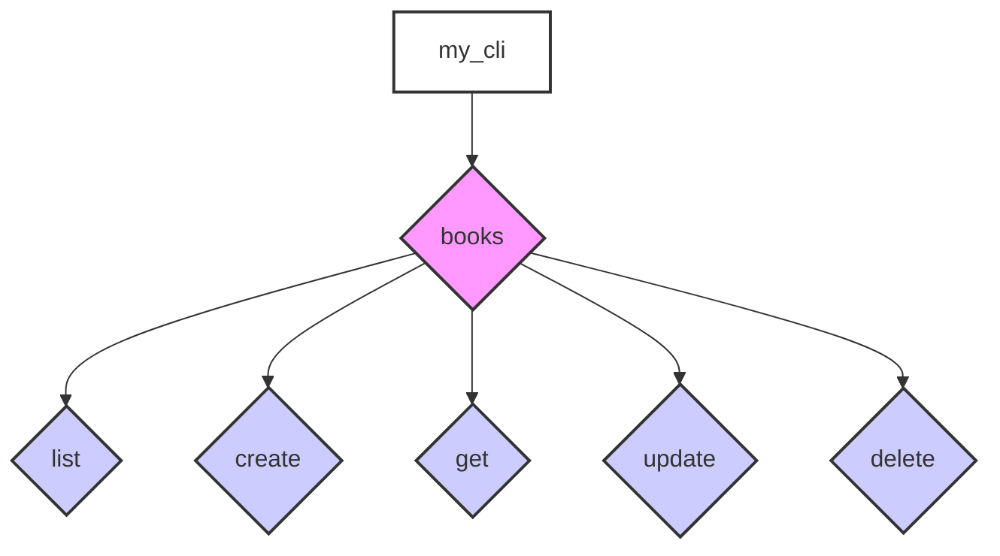

## The Anatomy of Your Auto-Generated CLI

You've successfully generated a Python Click-based CLI tool tailored to your API. But what does that generated code look like? Understanding its structure will empower you to use it effectively and, if needed, extend it further.

`firestone` takes your high-level resource blueprint and translates it into a standard Click command hierarchy, ensuring a predictable and intuitive user experience.

## The Big Picture: Command Hierarchy

The `kind` of your resource plays a central role in shaping the CLI's command structure.


In this example, `my_cli` is the main entry point, `books` is a command group corresponding to your `kind`, and `list`, `create`, `get`, `update`, and `delete` are subcommands corresponding to your enabled `methods`.

## Mapping Blueprint to CLI

Here's a breakdown of how your `firestone` resource blueprint components map to the generated Click CLI:

### 1. Resource `kind` → Command Group
The `kind` of your resource becomes a top-level command group.

```yaml
# In your resource blueprint:
kind: books
```
```bash
# In your generated CLI:
my_cli books --help
```

### 2. Enabled `methods` → Subcommands
For each `kind`, `firestone` creates subcommands corresponding to the HTTP methods you've enabled (`methods` block) for `resource` and `instance` levels.

-   `GET` (collection) → `list` subcommand
-   `POST` (collection) → `create` subcommand
-   `GET` (instance) → `get` subcommand
-   `PUT` (instance) → `update` subcommand
-   `DELETE` (instance) → `delete` subcommand

```yaml
# In your resource blueprint:
methods:
  resource: [get, post]
  instance: [get, put, delete]
```
```bash
# In your generated CLI:
my_cli books list      # Maps to GET /books
my_cli books create    # Maps to POST /books
my_cli books get <id>  # Maps to GET /books/{id}
my_cli books update <id> # Maps to PUT /books/{id}
my_cli books delete <id> # Maps to DELETE /books/{id}
```

### 3. Resource `key` → Required Argument
The unique identifier (`key` block) for your resource becomes a required positional argument for instance-level commands.

```yaml
# In your resource blueprint:
schema:
  key:
    name: book_id
    schema: { type: string }
```
```bash
# In your generated CLI:
my_cli books get <book_id>
```
Click handles the parsing and type conversion based on the `schema` defined for your key.

### 4. `schema.items.properties` → Options for `create` and `update`
The fields you define in your resource `schema.items.properties` (e.g., `title`, `author`) are automatically converted into Click options for the `create` and `update` commands.

```yaml
# In your resource blueprint:
schema:
  items:
    properties:
      title: { type: string }
      author: { type: string }
```
```bash
# In your generated CLI:
my_cli books create --title "1984" --author "George Orwell"
my_cli books update <book_id> --title "Animal Farm"
```
Click automatically validates these options against the JSON Schema types (`string`, `integer`, `boolean`, etc.) you defined.

### 5. `query_params` → Options for `list`
Resource-specific query parameters (from your `query_params` block) become options for the `list` subcommand.

```yaml
# In your resource blueprint:
schema:
  query_params:
    - name: genre
      schema: { type: string, enum: [fiction, scifi] }
```
```bash
# In your generated CLI:
my_cli books list --genre scifi
```

### 6. `default_query_params` → Global Options
Universal query parameters (from your `default_query_params` block, like `limit` and `offset`) become global options available on relevant commands (e.g., `list`).

```yaml
# In your resource blueprint (top-level):
default_query_params:
  - name: limit
    schema: { type: integer }
```
```bash
# In your generated CLI:
my_cli books list --limit 10
```

## Modular CLI Structure (`--as-modules`)

When you generate a modular CLI using the `--as-modules` option, `firestone` creates a Python package with a clear directory structure:

```
my_cli_package/
├── __init__.py          # Python package initializer
├── main.py              # Main CLI entry point, registers resource groups
├── books.py             # Contains Click commands for the 'books' resource
├── authors.py           # Contains Click commands for the 'authors' resource
└── common.py            # Utility functions (e.g., API client setup)
```
This modular approach keeps your generated code organized and makes it easier to extend individual resource commands or add custom utilities.

## Connecting to Your API

The generated CLI uses the API client library you specified with `--client-pkg` (which you would have generated from your OpenAPI spec using `openapi-generator`). It handles the HTTP requests, authentication, and data serialization/deserialization behind the scenes.

When you run a command like `my_cli books list`, the CLI:
1.  Parses your command and options.
2.  Uses the API client to construct and send the appropriate HTTP request to your API.
3.  Receives the API response.
4.  Formats and displays the response in a user-friendly way (e.g., JSON output).

---
## Next Steps

You now have a good grasp of how `firestone` structures your generated CLI. What if you want to add your own custom commands or modify existing behavior?
- **Next:** Discover how to extend and tailor your generated CLI in **[Customizing Your CLI](./cli-customization)**.
