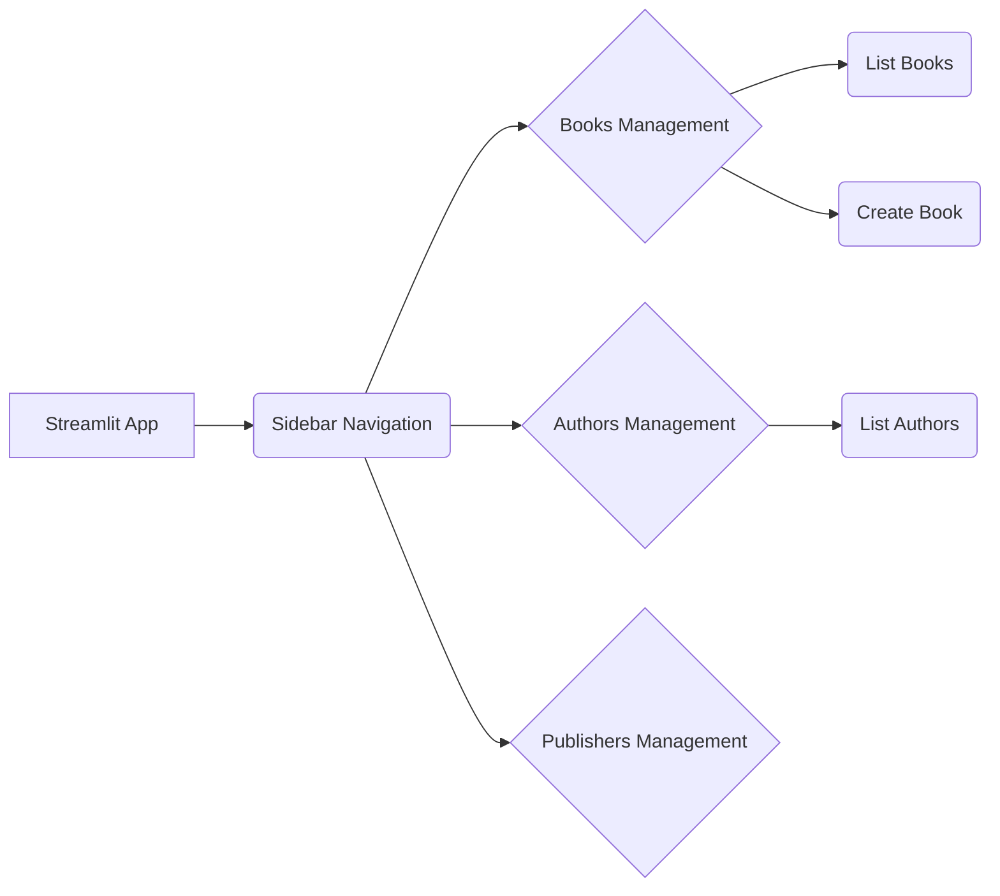

## Your Interactive Dashboard, At Your Fingertips

You've successfully generated a Streamlit UI from your `firestone` resource blueprints. This isn't just a static display; it's a fully interactive web application designed to help you manage your API's data visually.

This section explores the key features and functionalities you'll find in your generated Streamlit UIs, showcasing how `firestone` translates your API's blueprint into a user-friendly management interface.

## 1. Seamless Resource Navigation (Modular UIs)

If you generated a modular Streamlit UI (using `--as-modules` with multiple `--resources`), your application will feature a sidebar with a clear navigation menu. Each resource (e.g., "Books", "Authors") will have its own dedicated page in the UI, allowing you to switch between managing different API entities effortlessly.

![Streamlit Sidebar Navigation (Conceptual Diagram)]

## 2. Interactive Data Table Display

The core of any data management UI is the ability to view data clearly. Your generated Streamlit UI displays your resource collections in interactive data tables.

-   **Automatic Column Mapping:** `firestone` automatically maps your resource's properties (from `schema.items.properties`) to columns in the table.
-   **Configurable Columns:** You can customize the order and visibility of columns using the `--col-mappings` option during generation.
-   **Readability:** Data types are intelligently displayed, making your API data easy to consume.

## 3. Full CRUD Operations

The generated UI provides intuitive controls for all standard Create, Read, Update, and Delete (CRUD) operations, reflecting the `methods` you defined in your resource blueprint.

### Create New Resources
-   **Dynamic Forms:** Click a "Create New" button, and `firestone` generates a dynamic form based on your resource's `schema.items.properties`. Input fields appear for each property, respecting data types (text input for strings, number input for integers/numbers, checkboxes for booleans, etc.).
-   **Validation:** Input validation (e.g., `minLength`, `enum`, `pattern`) defined in your JSON Schema is often reflected in the UI, guiding users to enter valid data.

### View Resource Details
-   Click on a row in the data table or a "View Details" button to see a single resource's full details in a dedicated view.

### Update Existing Resources
-   **Edit Forms:** An "Edit" button will transform the detail view into an editable form, pre-populating fields with the current resource data. Make changes and click "Save" to send an `UPDATE` request to your API.

### Delete Resources
-   **Confirmation Dialogs:** A "Delete" button will typically include a confirmation step to prevent accidental deletions.

## 4. Search and Filtering

If you defined `query_params` in your resource blueprint, `firestone` automatically generates input widgets for these parameters in your Streamlit UI. This allows users to easily filter the displayed data.

-   **Text Inputs:** For string-based filters (e.g., `title`, `author`).
-   **Dropdowns:** For `enum`-based filters (e.g., `genre`, `status`).
-   **Date Pickers:** For `date-time` or `date` formatted strings.

## 5. Pagination and Sorting

If you configured `default_query_params` for pagination (`limit`, `offset`, or `page`, `per_page`), the generated UI will include pagination controls.

-   **Next/Previous Buttons:** Navigate through pages of data.
-   **Page Size Selector:** Adjust the number of items displayed per page.
-   **Sort Controls (Conceptual):** While direct sorting controls might require customization, the underlying data is accessible for various ordering.

## 6. Dynamic Input Widgets

`firestone` intelligently selects appropriate Streamlit widgets based on your JSON Schema property definitions:

-   **`type: string`**: `st.text_input`
-   **`type: integer`, `type: number`**: `st.number_input`
-   **`type: boolean`**: `st.checkbox`
-   **`enum: [...]`**: `st.selectbox`
-   **`format: date-time`**: `st.date_input` or `st.time_input` (depending on granularity)

## Best Practices for Using Generated UIs

-   **Always Run Your API:** The Streamlit UI is a client. It needs your `firestone`-backed API server running (reachable via `--backend-url`) to function.
-   **Start with Modular:** For any API with more than one resource, generate the UI with `--as-modules` for better organization and navigation.
-   **Customize with Templates:** If the default UI isn't quite right, use custom templates (`--template`) to adapt it to your specific branding or workflow.
-   **Consider `firestone-lib`:** For highly specialized Streamlit applications that need more control, you might integrate `firestone-lib` directly into your custom Streamlit app to parse and interact with your resource schemas.

---
## Next Steps

You've explored the rich interactive features of your `firestone`-generated Streamlit UIs. You now have a complete understanding of how `firestone` transforms your resource blueprints into powerful APIs, CLIs, and UIs.

- **Next:** Dive into how `firestone` supports more advanced architectural patterns in the **[Advanced Guides](../../advanced-topics/custom-templates.md)** section.
