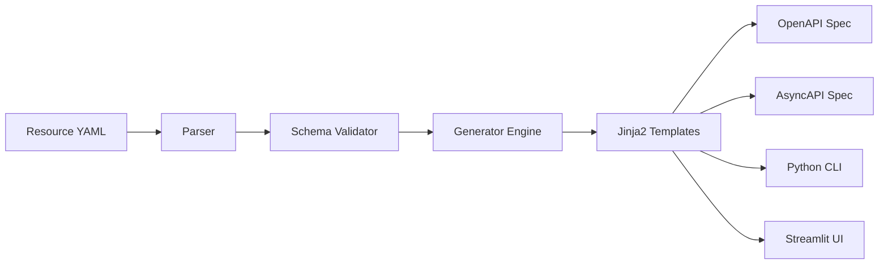
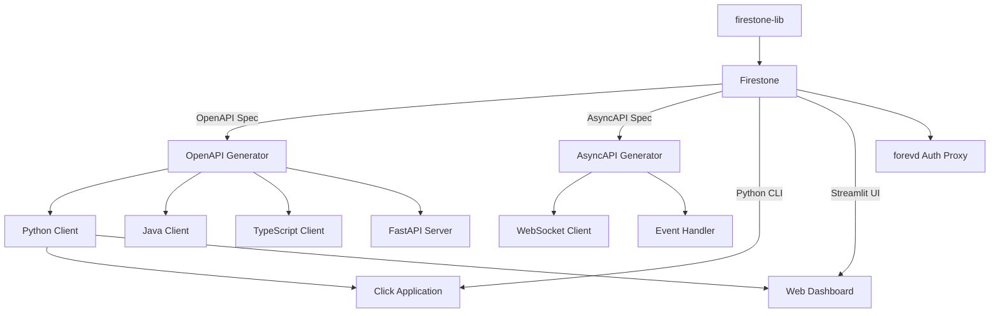

+++
title = "System Architecture"
weight = 3
description = "Understanding firestone's generation pipeline, template system, and ecosystem integration."
+++

## Overview

Firestone is built around a simple but powerful architecture: **define your resources once in JSON Schema, then generate everything else automatically**. This document explores how firestone transforms resource definitions into production-ready API specifications and code.

## The Generation Pipeline

At its core, firestone follows a multi-stage pipeline:



### Stage 1: Resource Parsing

When you run `firestone generate`, the tool first loads and parses your resource YAML files. This stage:

- Reads YAML resource definitions
- Validates the basic structure
- Resolves `$ref` references to other resource files
- Merges metadata with schema definitions

### Stage 2: Schema Validation

Next, firestone validates your JSON Schema definitions to ensure they're:

- **Valid JSON Schema** - Compliant with the JSON Schema specification
- **Complete** - Contains required fields like `kind`, `apiVersion`, and `schema`
- **Consistent** - Methods, descriptions, and security settings align with the schema

If validation fails, you'll get clear error messages pointing to the issue.

### Stage 3: Generation Engine

The generation engine is where the magic happens. Based on the output format you've requested (`openapi`, `asyncapi`, `cli`, or `streamlit`), firestone:

1. **Builds component schemas** - Extracts reusable schema components
2. **Generates paths/channels** - Creates endpoints for resource and instance operations
3. **Maps methods to operations** - Translates HTTP methods to API operations
4. **Applies security schemes** - Adds authentication/authorization as specified
5. **Resolves query parameters** - Combines resource-specific and default parameters

### Stage 4: Template Rendering

Finally, firestone uses Jinja2 templates to render the output. Each output format has its own template:

- `openapi.jinja2` - OpenAPI 3.0 specification
- `asyncapi.jinja2` - AsyncAPI 2.5 specification
- `main.py.jinja2` - Standalone Click CLI script
- `cli_module.py.jinja2` - CLI module for integration
- `streamlit.py.jinja2` - Streamlit dashboard application

## The Jinja2 Template System

Firestone leverages Jinja2's powerful templating engine to separate generation logic from output format. This design provides several benefits:

### Custom Templates

You can override the default templates by providing your own:

```bash
firestone generate \
    --resources addressbook.yaml \
    cli \
    --template my-custom-template.jinja2
```

This lets you:
- Customize code formatting and style
- Add organization-specific headers or imports
- Integrate with internal frameworks
- Generate output in entirely new formats

### Template Variables

Templates have access to rich context data:

```jinja2
{# Available in all templates #}
{{ title }}          {# API/CLI title #}
{{ description }}    {# API/CLI description #}
{{ version }}        {# API version #}

{# OpenAPI/AsyncAPI templates #}
{{ components }}     {# Schema components #}
{{ paths }}          {# API paths (OpenAPI) #}
{{ channels }}       {# Channels (AsyncAPI) #}
{{ servers }}        {# Server configurations #}

{# CLI templates #}
{{ rsrcs }}          {# List of resources with operations #}
{{ pkg }}            {# Package name #}
{{ client_pkg }}     {# Client package for API calls #}
```

### Template Inheritance

Firestone's templates use Jinja2 inheritance for maintainability:

```jinja2
{# base_cli.jinja2 #}

import click
from {{ client_pkg }} import ApiClient, Configuration


{# cli_module.jinja2 extends base_cli.jinja2 #}



# Include parent imports and add new ones
from {{ pkg }}.models import {{ rsrc.name | capitalize }}

```

## Component Architecture

Firestone is organized into focused Python modules:

```
firestone/
├── spec/
│   ├── _base.py         # Shared utilities and base classes
│   ├── openapi.py       # OpenAPI generation logic
│   ├── asyncapi.py      # AsyncAPI generation logic
│   ├── cli.py           # CLI generation logic
│   └── streamlit.py     # Streamlit generation logic
├── schema/              # Jinja2 templates
│   ├── openapi.jinja2
│   ├── asyncapi.jinja2
│   ├── main.py.jinja2
│   ├── cli_module.py.jinja2
│   ├── streamlit.py.jinja2
│   └── streamlit_page.py.jinja2
└── __main__.py          # CLI entry point
```

### Base Module (`_base.py`)

The base module provides shared functionality used across all generators:

- **Schema utilities** - Common schema parsing and transformation
- **Operation ID generation** - Consistent naming for operations
- **Jinja2 environment** - Configured template loader
- **Constants** - Default values like content types

### Generator Modules

Each output format has a dedicated generator module:

- **`openapi.py`** - Generates OpenAPI 3.0 specs with full REST semantics
- **`asyncapi.py`** - Generates AsyncAPI 2.5 specs for WebSocket channels
- **`cli.py`** - Generates Python Click CLIs with CRUD operations
- **`streamlit.py`** - Generates Streamlit dashboard applications

These modules share a common pattern:
1. Extract resource metadata and schema
2. Build paths/channels/operations
3. Generate components
4. Render template with context

## Ecosystem Integration

Firestone is designed to integrate seamlessly with the broader API ecosystem:



### Integration Points

**1. OpenAPI Ecosystem**

Generated OpenAPI specs work with:
- [OpenAPI Generator](https://openapi-generator.tech/) - Client/server code generation
- [Swagger UI](https://swagger.io/tools/swagger-ui/) - Interactive API documentation
- [Postman](https://www.postman.com/) - API testing and collection generation
- [FastAPI](https://fastapi.tiangolo.com/) - Python server framework

**2. AsyncAPI Ecosystem**

Generated AsyncAPI specs integrate with:
- [AsyncAPI Generator](https://www.asyncapi.com/tools/generator) - Code and documentation
- WebSocket servers and clients
- Event-driven architecture tools

**3. Python Ecosystem**

Generated CLIs and code use:
- [Click](https://click.palletsprojects.com/) - Command-line interface creation
- [Streamlit](https://streamlit.io/) - Data application framework
- Standard Python clients from OpenAPI Generator

**4. Firestone Ecosystem**

Within the firestone project family:
- **firestone-lib** - Shared library for common functionality
- **forevd** - Authentication/authorization proxy for protecting generated APIs
- **bindy/bindcar** - Kubernetes-native DNS management (uses firestone principles)

## The firestone vs firestone-lib Split

The firestone ecosystem actually consists of two packages:

### firestone (CLI Tool)

The main `firestone` package provides:
- Command-line interface for generation
- Template rendering
- Output to stdout or files
- Built-in Swagger UI server for testing

Install with:
```bash
poetry add firestoned  # Note: 'd' suffix
```

Use for:
- Generating specifications during development
- Building CI/CD pipelines
- Creating one-off CLIs

### firestone-lib (Library)

The `firestone-lib` package provides:
- Programmatic API for generation
- Reusable schema utilities
- Template customization hooks
- Embeddable in other tools

Install with:
```bash
poetry add firestone-lib
```

Use for:
- Embedding generation in your own tools
- Programmatic spec generation
- Custom workflows and automation

Example using the library directly:

```python
from firestone_lib.spec import openapi

# Load resource data
with open('addressbook.yaml') as f:
    rsrc_data = [yaml.safe_load(f)]

# Generate OpenAPI spec
spec = openapi.generate(
    rsrc_data=rsrc_data,
    title='Addressbook API',
    desc='A simple addressbook',
    summary='Manage contacts',
    version='1.0.0'
)

print(spec)  # YAML string of OpenAPI spec
```

## Design Principles

Firestone's architecture embodies several key principles:

### 1. Resource-First Thinking

Everything starts with resources. Rather than writing OpenAPI specs or API code directly, you define what your resources look like, and firestone handles the rest.

### 2. Single Source of Truth

Your JSON Schema resource definitions are the **only** source of truth. All generated specs, CLIs, and UIs derive from these definitions. Change the schema, regenerate, and everything updates consistently.

### 3. Separation of Concerns

The architecture cleanly separates:
- **Schema definition** (your YAML files)
- **Generation logic** (Python modules)
- **Output formatting** (Jinja2 templates)

This makes each layer independently testable and customizable.

### 4. Standards Compliance

Firestone generates specs that comply with:
- OpenAPI 3.0+ specification
- AsyncAPI 2.5+ specification
- JSON Schema specification
- Python packaging standards (PEP 517, PEP 518)

### 5. Extensibility

Every part of firestone is designed to be extended:
- Custom templates for any output format
- Plugin-based generation for new formats
- Programmatic API via firestone-lib

## Performance Considerations

Firestone is optimized for developer productivity, not runtime performance (since it's a build-time tool). However, some characteristics are worth noting:

### Generation Speed

- **Small projects (1-3 resources)**: < 1 second
- **Medium projects (4-10 resources)**: 1-3 seconds
- **Large projects (10+ resources)**: 3-10 seconds

Most time is spent in:
1. YAML parsing
2. JSON Schema validation
3. Template rendering

### Memory Usage

Firestone loads entire resource schemas into memory, then builds complete output specs before rendering. For most projects, this is negligible (<100MB). For very large schemas (100+ resources), expect higher memory usage.

### Caching

Currently, firestone does not cache intermediate results. Each generation runs fresh from YAML to output. This ensures consistency but means regeneration takes the same time as initial generation.

## Next Steps

Now that you understand firestone's architecture, explore:

- **[Why Resource-First?](./why-resource-first)** - The philosophy behind this approach
- **[Getting Started](../getting-started/)** - Install and try firestone yourself
- **[Resource Schema Reference](../core-concepts/resource-schema)** - Deep dive into schema syntax