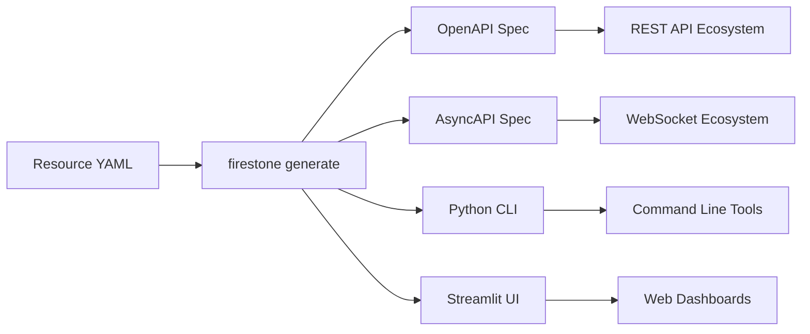
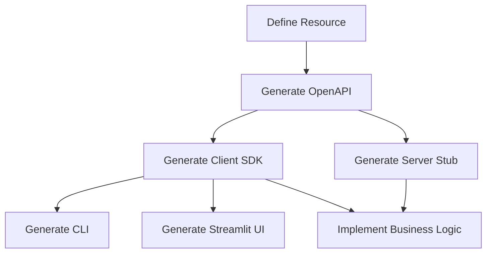

## Overview

Firestone transforms a single resource definition into multiple output formats. This guide explains what each output format provides, when to use it, and how they work together.

## The Four Output Formats



## OpenAPI Generation

### What It Produces

An OpenAPI 3.0 specification file (YAML or JSON) that fully describes a REST API.

```bash
firestone generate \
    --resources book.yaml \
    --title "Library API" \
    --version "1.0.0" \
    openapi > openapi.yaml
```

### What's In the Spec

**Complete API definition:**
- All REST endpoints (`/books`, `/books/{id}`)
- HTTP methods (GET, POST, PUT, DELETE)
- Request schemas (what clients send)
- Response schemas (what API returns)
- Path parameters, query parameters
- Security schemes and requirements
- Server URLs and metadata

**Example output:**

```yaml
openapi: 3.0.0
info:
  title: Library API
  version: 1.0.0
paths:
  /books:
    get:
      operationId: get_books
      responses:
        '200':
          description: Success
          content:
            application/json:
              schema:
                type: array
                items:
                  $ref: '#/components/schemas/Book'
    post:
      operationId: post_books
      requestBody:
        required: true
        content:
          application/json:
            schema:
              $ref: '#/components/schemas/CreateBook'
      responses:
        '201':
          description: Created
  /books/{book_id}:
    get:
      operationId: get_books_book_id
      parameters:
        - name: book_id
          in: path
          required: true
          schema:
            type: string
      responses:
        '200':
          description: Success
          content:
            application/json:
              schema:
                $ref: '#/components/schemas/Book'
components:
  schemas:
    Book:
      type: object
      properties:
        title:
          type: string
        author:
          type: string
```

### What You Can Do With It

**1. Generate Client SDKs**

Use OpenAPI Generator to create client libraries:

```bash
# Python client
openapi-generator generate \
    -i openapi.yaml \
    -g python \
    -o ./python-client

# Java client
openapi-generator generate \
    -i openapi.yaml \
    -g java \
    -o ./java-client

# TypeScript/Fetch client
openapi-generator generate \
    -i openapi.yaml \
    -g typescript-fetch \
    -o ./ts-client
```

**2. Generate Server Stubs**

```bash
# FastAPI server
openapi-generator generate \
    -i openapi.yaml \
    -g python-fastapi \
    -o ./server

# Spring Boot server
openapi-generator generate \
    -i openapi.yaml \
    -g spring \
    -o ./spring-server
```

**3. Interactive Documentation**

View in Swagger UI:

```bash
# Built-in server
firestone generate \
    --resources book.yaml \
    openapi \
    --ui-server
# Opens at http://127.0.0.1:5000/apidocs
```

Or import into:
- Swagger UI
- Redoc
- Postman
- Stoplight

**4. API Testing**

Import into testing tools:
- Postman collections
- Insomnia
- REST Client
- httpie

### When to Use OpenAPI

**Use OpenAPI generation when:**
- Building a REST API
- Need client libraries in multiple languages
- Want interactive API documentation
- Integrating with API gateways or management tools
- Following OpenAPI-first workflows

**Generated files:**
- `openapi.yaml` or `openapi.json`
- Compatible with OpenAPI 3.0+ tools

## AsyncAPI Generation

### What It Produces

An AsyncAPI 2.5 specification file describing WebSocket channels and messages.

```bash
firestone generate \
    --resources book.yaml \
    --title "Library Events" \
    --version "1.0.0" \
    asyncapi > asyncapi.yaml
```

### What's In the Spec

**Event-driven API definition:**
- WebSocket channels (similar to REST paths)
- Publish/subscribe operations
- Message schemas
- Server configurations
- Channel parameters

**Example output:**

```yaml
asyncapi: 2.5.0
info:
  title: Library Events
  version: 1.0.0
servers:
  dev:
    url: ws://localhost
    protocol: ws
    description: Development WebSocket server
channels:
  /books:
    subscribe:
      operationId: subscribe_books
      message:
        name: books
        contentType: application/json
        payload:
          type: array
          items:
            $ref: '#/components/schemas/Book'
    publish:
      operationId: publish_books
      message:
        name: books
        contentType: application/json
        payload:
          $ref: '#/components/schemas/Book'
components:
  schemas:
    Book:
      type: object
      properties:
        title:
          type: string
```

### What You Can Do With It

**1. Generate WebSocket Clients**

```bash
asyncapi generate fromTemplate \
    asyncapi.yaml \
    @asyncapi/nodejs-ws-template
```

**2. Generate Documentation**

```bash
asyncapi generate fromTemplate \
    asyncapi.yaml \
    @asyncapi/html-template
```

**3. Event-Driven Architecture**

Use as the contract for:
- WebSocket servers
- Message brokers
- Event streaming platforms

### When to Use AsyncAPI

**Use AsyncAPI generation when:**
- Building real-time features
- Using WebSocket communication
- Implementing publish/subscribe patterns
- Need live updates in clients

**Required configuration:**

Your resource must include AsyncAPI configuration:

```yaml
asyncapi:
  servers:
    dev:
      url: ws://localhost
      protocol: ws
  channels:
    resources: true
    instances: true
```

**Generated files:**
- `asyncapi.yaml` or `asyncapi.json`
- Compatible with AsyncAPI 2.5+ tools

## CLI Generation

### What It Produces

A Python script using Click framework that provides CRUD commands for your API.

```bash
firestone generate \
    --resources book.yaml \
    --title "Library CLI" \
    --version "1.0.0" \
    cli \
    --pkg library \
    --client-pkg library_client > cli.py
```

### What's In the CLI

**Generated commands:**

```bash
# List resources
python cli.py books list [--limit N] [--offset N]

# Create resource
python cli.py books create --title "..." --author "..."

# Get specific resource
python cli.py books get <book_id>

# Update resource
python cli.py books update <book_id> --title "..."

# Delete resource
python cli.py books delete <book_id>
```

**Built-in features:**
- Host configuration (`--host`)
- JSON/YAML input for complex fields
- Auto-generated help
- Type validation
- Enum choices

**Example usage:**

```bash
# Create a book
python cli.py books create \
    --title "The Great Gatsby" \
    --author "F. Scott Fitzgerald" \
    --isbn "978-0-7432-7356-5"

# List books with filtering
python cli.py books list --limit 10

# Update a book
python cli.py books update book-123 \
    --title "Updated Title"

# Delete a book
python cli.py books delete book-123
```

### CLI Structure

**Single-file mode (default):**

```python
#!/usr/bin/env python
"""Library CLI - Auto-generated by firestone"""

import click
from library_client import ApiClient, Configuration
from library_client.api import BooksApi

@click.group()
@click.option('--host', default='http://localhost:8080')
@click.pass_context
def cli(ctx, host):
    """Library CLI"""
    config = Configuration(host=host)
    ctx.obj = ApiClient(config)

@cli.group()
def books():
    """Manage books"""
    pass

@books.command('list')
@click.option('--limit', type=int)
@click.pass_context
def list_books(ctx, limit):
    """List all books"""
    api = BooksApi(ctx.obj)
    result = api.get_books(limit=limit)
    click.echo(result)

# More commands...
```

**Module mode (with --as-modules):**

Generates separate modules for each resource:

```bash
firestone generate \
    --resources book.yaml,author.yaml \
    cli \
    --pkg library \
    --client-pkg library_client \
    --as-modules
```

Creates:
- `books.py` - Book commands
- `authors.py` - Author commands

### When to Use CLI Generation

**Use CLI generation when:**
- Building command-line tools for APIs
- Need scriptable access to resources
- Want to provide developer-friendly interfaces
- Building internal tools or admin interfaces

**Prerequisites:**
- OpenAPI client SDK generated first
- Python 3.9+
- Click library available

**Generated files:**
- `cli.py` (single file) or
- `<resource>.py` (module mode)

## Streamlit Generation

### What It Produces

A Streamlit web application providing a dashboard UI for your API.

```bash
firestone generate \
    --resources book.yaml \
    --title "Library Dashboard" \
    streamlit > app.py
```

### What's In the App

**Generated UI components:**

- **Resource list view** - Table/grid of all resources
- **Create form** - Input form for new resources
- **Detail view** - Single resource display
- **Update form** - Edit existing resources
- **Delete button** - Remove resources

**Features:**
- Auto-generated forms from schema
- Type-appropriate inputs (text, number, select, checkbox)
- Validation based on schema constraints
- Real-time API interaction
- Error handling and display

**Example UI:**

```python
import streamlit as st
from library_client import ApiClient, BooksApi

st.title("Library Dashboard")

# Sidebar for navigation
page = st.sidebar.selectbox("Page", ["List Books", "Add Book"])

if page == "List Books":
    api = BooksApi(ApiClient())
    books = api.get_books()

    for book in books:
        st.subheader(book.title)
        st.write(f"Author: {book.author}")
        st.write(f"ISBN: {book.isbn}")

elif page == "Add Book":
    with st.form("create_book"):
        title = st.text_input("Title")
        author = st.text_input("Author")
        isbn = st.text_input("ISBN")

        if st.form_submit_button("Create"):
            api = BooksApi(ApiClient())
            book = api.post_books(title=title, author=author, isbn=isbn)
            st.success(f"Created book: {book.title}")
```

### Running the App

```bash
streamlit run app.py
```

Opens browser at `http://localhost:8501`

### When to Use Streamlit

**Use Streamlit generation when:**
- Need a quick admin interface
- Building internal dashboards
- Prototyping UIs rapidly
- Want browser-based resource management

**Prerequisites:**
- Streamlit installed (`pip install streamlit`)
- OpenAPI client SDK generated

**Generated files:**
- `app.py` (main application) or
- `app.py` + `pages/<resource>.py` (multi-page)

## Combining Outputs

The real power is using outputs together:

### Complete Workflow



**Step-by-step:**

```bash
# 1. Generate OpenAPI spec
firestone generate --resources book.yaml openapi > openapi.yaml

# 2. Generate Python client
openapi-generator generate -i openapi.yaml -g python -o client/

# 3. Generate CLI using client
firestone generate --resources book.yaml cli \
    --pkg library --client-pkg library.client > cli.py

# 4. Generate Streamlit UI using client
firestone generate --resources book.yaml streamlit > app.py

# 5. Generate server stub
openapi-generator generate -i openapi.yaml -g python-fastapi -o server/

# 6. Implement business logic in server/
```

Now you have:
- ✅ REST API specification
- ✅ Python client library
- ✅ Command-line tool
- ✅ Web dashboard
- ✅ Server foundation

### Multi-Resource Projects

For multiple resources:

```bash
# Generate combined OpenAPI spec
firestone generate \
    --resources book.yaml,author.yaml,publisher.yaml \
    openapi > openapi.yaml

# Generate client
openapi-generator generate -i openapi.yaml -g python -o client/

# Generate CLI with all resources
firestone generate \
    --resources book.yaml,author.yaml,publisher.yaml \
    cli --pkg library --client-pkg library.client > cli.py
```

CLI has commands for all resources:
- `cli.py books ...`
- `cli.py authors ...`
- `cli.py publishers ...`

## Output Comparison

| Feature | OpenAPI | AsyncAPI | CLI | Streamlit |
|---------|---------|----------|-----|-----------|
| **Purpose** | REST API spec | WebSocket spec | Command tool | Web dashboard |
| **Output** | YAML/JSON | YAML/JSON | Python script | Python app |
| **Use Case** | Client/server gen | Event-driven | Automation | Admin UI |
| **Prerequisites** | None | AsyncAPI config | Client SDK | Client SDK + Streamlit |
| **Ecosystem** | Massive | Growing | Python | Python |
| **Maturity** | Very mature | Mature | Stable | Stable |

## Best Practices

### 1. Always Generate OpenAPI First

It's the foundation for everything else:

```bash
firestone generate --resources *.yaml openapi > openapi.yaml
```

### 2. Use Client SDKs

Don't hand-write API clients; generate them:

```bash
openapi-generator generate -i openapi.yaml -g python -o client/
```

### 3. Version Your Specs

Treat generated specs as source files:

```bash
git add openapi.yaml asyncapi.yaml
git commit -m "Update API spec"
```

### 4. Automate Generation

Use scripts or CI/CD:

```bash
#!/bin/bash
# generate.sh

firestone generate --resources resources/*.yaml openapi > openapi.yaml
firestone generate --resources resources/*.yaml asyncapi > asyncapi.yaml
openapi-generator generate -i openapi.yaml -g python -o client/
firestone generate --resources resources/*.yaml cli > cli.py
```

### 5. Customize With Templates

For production use, customize output:

```bash
firestone generate --resources book.yaml cli \
    --template custom-cli.jinja2 > cli.py
```

## Next Steps

Now that you understand generation outputs:

- **[OpenAPI Generation Guide](../../openapi-generation/)** - Deep dive into OpenAPI
- **[AsyncAPI Generation Guide](../../asyncapi-generation/)** - WebSocket details
- **[CLI Generation Guide](../../cli-generation/)** - CLI customization
- **[Streamlit Generation Guide](../../streamlit-generation/)** - Dashboard building

Or explore real examples:

- **[Addressbook Tutorial](../../examples/addressbook-tutorial)** - Complete workflow
- **[Multi-Resource Example](../../examples/multi-resource)** - Complex projects

