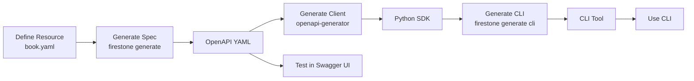

## What You'll Build

In this tutorial, you'll create a simple **Book** resource for a library API. By the end, you'll have:

- ✅ A resource definition in YAML
- ✅ A generated OpenAPI 3.0 specification
- ✅ A generated Python CLI with CRUD commands
- ✅ A working understanding of firestone's workflow

**Time required:** 5-10 minutes

## Prerequisites

- Firestone installed ([Installation Guide](./installation))
- A text editor
- Basic command-line familiarity

## Step 1: Create Your Project Directory

Let's create a clean workspace:

```bash
mkdir library-api
cd library-api
```

## Step 2: Define Your Resource

Create a file called `book.yaml` with your resource definition:

```yaml
# book.yaml
kind: books
apiVersion: v1
metadata:
  description: A collection of books in our library
versionInPath: false

# Define which HTTP methods to expose
methods:
  resource:
    - get      # List all books
    - post     # Create a new book
  instance:
    - get      # Get a specific book
    - put      # Update a book
    - delete   # Delete a book

# Human-readable descriptions for each operation
descriptions:
  resource:
    get: List all books in the library
    post: Add a new book to the library
  instance:
    get: Get details of a specific book
    put: Update a book's information
    delete: Remove a book from the library

# The core schema definition
schema:
  type: array

  # Define the unique identifier for each book
  key:
    name: book_id
    description: Unique identifier for a book
    schema:
      type: string

  # Define the book's properties
  items:
    type: object
    properties:
      title:
        description: The book's title
        type: string
      author:
        description: The book's author
        type: string
      isbn:
        description: International Standard Book Number
        type: string
      year:
        description: Year of publication
        type: integer
      genre:
        description: Book genre
        type: string
        enum:
          - fiction
          - non-fiction
          - science
          - history
          - biography
      available:
        description: Whether the book is available for checkout
        type: boolean
        default: true

    # Required fields when creating a book
    required:
      - title
      - author
      - isbn
```

Let's break down what this defines:

- **kind: books** - The resource name (becomes `/books` in your API)
- **methods** - Which HTTP operations to support (GET, POST, PUT, DELETE)
- **schema.key** - The unique identifier (`book_id`)
- **schema.items.properties** - All the fields a book can have
- **required** - Fields that must be provided when creating a book

## Step 3: Generate an OpenAPI Specification

Now let's generate an OpenAPI spec from your resource:

```bash
firestone generate \
    --title "Library API" \
    --description "API for managing a library's book collection" \
    --version "1.0.0" \
    --resources book.yaml \
    openapi > openapi.yaml
```

**What just happened?**

Firestone read your resource definition and generated a complete OpenAPI 3.0 spec with:
- Paths for `/books` (list, create)
- Paths for `/books/{book_id}` (get, update, delete)
- Request/response schemas
- Proper HTTP status codes
- Parameter definitions

### View Your Spec

Let's look at what was generated:

```bash
cat openapi.yaml
```

You'll see a complete OpenAPI spec. Here's a snippet:

```yaml
openapi: 3.0.0
info:
  title: Library API
  description: API for managing a library's book collection
  version: 1.0.0
paths:
  /books:
    get:
      summary: List all books in the library
      operationId: get_books
      responses:
        '200':
          description: Success
          content:
            application/json:
              schema:
                type: array
                items:
                  $ref: '#/components/schemas/Book'
    post:
      summary: Add a new book to the library
      operationId: post_books
      requestBody:
        required: true
        content:
          application/json:
            schema:
              $ref: '#/components/schemas/CreateBook'
      # ... more
```

### Test with Swagger UI

Firestone includes a built-in Swagger UI server for testing:

```bash
firestone generate \
    --title "Library API" \
    --description "API for managing a library's book collection" \
    --version "1.0.0" \
    --resources book.yaml \
    openapi \
    --ui-server
```

This starts a web server. Open your browser to:
```
http://127.0.0.1:5000/apidocs
```

You'll see interactive API documentation where you can test endpoints!

Press `Ctrl+C` to stop the server.

## Step 4: Generate a Client SDK

Now let's generate a Python client SDK using OpenAPI Generator:

```bash
# Install openapi-generator if you haven't already
# macOS: brew install openapi-generator
# Linux: wget the JAR (see installation guide)

openapi-generator generate \
    -i openapi.yaml \
    -g python \
    -o ./client \
    --package-name library_client
```

This creates a complete Python client library in the `./client` directory with:
- API client classes
- Model classes for Book
- Configuration and authentication
- Documentation

## Step 5: Generate a Python CLI

Firestone can generate a Click-based CLI that uses your client SDK:

```bash
firestone generate \
    --title "Library CLI" \
    --description "Command-line interface for the Library API" \
    --version "1.0.0" \
    --resources book.yaml \
    cli \
    --pkg library \
    --client-pkg library_client > cli.py
```

This creates `cli.py`, a fully functional CLI with commands like:

- `python cli.py books list` - List all books
- `python cli.py books create` - Create a new book
- `python cli.py books get <book_id>` - Get a book
- `python cli.py books update <book_id>` - Update a book
- `python cli.py books delete <book_id>` - Delete a book

### Try the CLI

First, make it executable:

```bash
chmod +x cli.py
```

View the help:

```bash
python cli.py --help
```

Output:
```
Usage: cli.py [OPTIONS] COMMAND [ARGS]...

  Library CLI - Command-line interface for the Library API

Options:
  --host TEXT  API host (default: http://localhost:8080)
  --help       Show this message and exit.

Commands:
  books  Manage books
```

View books commands:

```bash
python cli.py books --help
```

Output:
```
Usage: cli.py books [OPTIONS] COMMAND [ARGS]...

  Manage books

Commands:
  create  Add a new book to the library
  delete  Remove a book from the library
  get     Get details of a specific book
  list    List all books in the library
  update  Update a book's information
```

## Step 6: Add Query Parameters

Let's enhance the resource with query parameters for filtering:

Edit `book.yaml` and add query parameters under `schema`:

```yaml
schema:
  type: array
  key:
    name: book_id
    # ... (keep existing key definition)

  # Add query parameters
  query_params:
    - name: genre
      description: Filter books by genre
      required: false
      schema:
        type: string
        enum:
          - fiction
          - non-fiction
          - science
          - history
          - biography
      methods:
        - get

    - name: available
      description: Filter by availability
      required: false
      schema:
        type: boolean
      methods:
        - get

  items:
    # ... (keep existing items definition)
```

Regenerate the spec:

```bash
firestone generate \
    --title "Library API" \
    --resources book.yaml \
    openapi > openapi.yaml
```

Now your API supports queries like:
- `GET /books?genre=fiction`
- `GET /books?available=true`
- `GET /books?genre=science&available=true`

## Step 7: Add Default Query Parameters

Let's add pagination support with default query parameters:

Edit `book.yaml` and add this at the top level (same level as `kind`):

```yaml
kind: books
apiVersion: v1
# ... existing fields ...

# Default query parameters available on all GET requests
default_query_params:
  - name: limit
    description: Maximum number of books to return
    in: query
    schema:
      type: integer
      default: 20

  - name: offset
    description: Number of books to skip
    in: query
    schema:
      type: integer
      default: 0

# ... rest of file ...
```

Regenerate:

```bash
firestone generate \
    --title "Library API" \
    --resources book.yaml \
    openapi > openapi.yaml
```

Now all GET endpoints automatically support:
- `GET /books?limit=10&offset=20`

## Step 8: View Generated CLI with Filters

Regenerate the CLI to see the new query parameters:

```bash
firestone generate \
    --title "Library CLI" \
    --resources book.yaml \
    cli \
    --pkg library \
    --client-pkg library_client > cli.py
```

Check the list command help:

```bash
python cli.py books list --help
```

You'll now see options for `--genre`, `--available`, `--limit`, and `--offset`!

## What You've Learned

In just a few minutes, you've:

✅ **Defined a resource** using JSON Schema in YAML
✅ **Generated an OpenAPI spec** with full CRUD operations
✅ **Created a Python CLI** with command-line arguments
✅ **Added query parameters** for filtering and pagination
✅ **Tested with Swagger UI** interactively

All from **one resource definition file**.

## Your Complete Workflow

Here's the workflow you just learned:



## Next Steps

Now that you've built your first resource, explore:

### Deepen Your Knowledge

- **[Resource Schema Anatomy](../core-concepts/resource-schema-anatomy)** - Understand every part of a resource file
- **[Resource Types](../core-concepts/resource-types)** - Learn about arrays, objects, and nested resources
- **[Generation Outputs](../core-concepts/generation-outputs)** - Explore all output formats

### Try More Advanced Features

- **[AsyncAPI Generation](../generation-guides/asyncapi)** - Add WebSocket support
- **[Security Schemes](../core-concepts/resource-schema/security.md)** - Add authentication
- **[Custom Descriptions](../core-concepts/resource-schema/descriptions.md)** - Better API documentation
- **[Nested Resources](../core-concepts/resource-schema/complex-nested-resources.md)** - Complex data structures

### Explore Real Examples

- **[Addressbook Tutorial](../examples/addressbook.md)** - Complete example with nested resources
- **[Persons Resource](../examples/simple-crud.md)** - Demonstrates security schemes
- **[Advanced Patterns](../examples/multi-resource-api.md)** - Complex schemas and relationships

### Integrate Into Your Workflow

- **[CI/CD Integration](../advanced-topics/docker-integration.md)** - Automate spec generation
- **[Version Control](../advanced-topics/versioning-strategies.md)** - Best practices for resources
- **[Testing](../advanced-topics/json-schema-validation.md)** - Validate generated specs

## Common Questions

### Can I generate multiple resources at once?

Yes! Just provide multiple resource files:

```bash
firestone generate \
    --title "Library API" \
    --resources book.yaml,author.yaml,publisher.yaml \
    openapi > openapi.yaml
```

### How do I add authentication?

Use security schemes in your resource:

```yaml
security:
  scheme:
    bearer_auth:
      scheme: bearer
      type: http
      bearerFormat: JWT
  resource:
    - post
  instance:
    - put
    - delete
```

See the [Security Guide](../core-concepts/resource-schema/security.md) for details.

### Can I customize the generated output?

Yes! Use custom Jinja2 templates:

```bash
firestone generate \
    --resources book.yaml \
    cli \
    --template my-template.jinja2 > cli.py
```

See the [Custom Templates Guide](../advanced-topics/custom-templates.md).

### What if I need non-CRUD operations?

Firestone is optimized for CRUD. For complex operations, consider:
- Generating the base spec with firestone
- Manually extending it with custom operations
- Using code-first approaches for complex logic

See [When to Use Firestone](why-resource-first.md#when-to-use-other-approaches).

## Getting Help

Stuck? Here's where to go:

- **[FAQ](../reference/overview.md)** - Common questions and answers
- **[Troubleshooting](../advanced-topics/troubleshooting-generation-failures.md)** - Solve common issues
- **[GitHub Issues](https://github.com/firestoned/firestone/issues)** - Ask the community
- **[Examples](../examples/)** - Learn from real code

Congratulations on building your first firestone resource! 🎉

