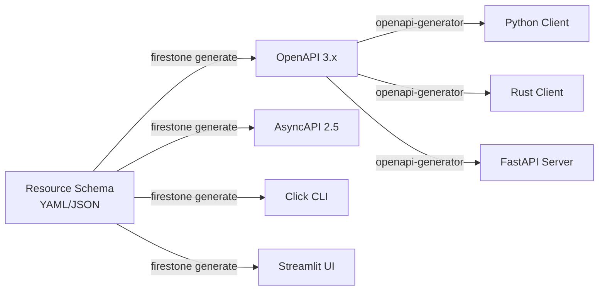

# What is firestone?

firestone is a code generation tool that builds API specifications, CLIs, and UIs from JSON Schema resource definitions.

## The Problem: API Boilerplate Fatigue

Building modern APIs involves a lot of repetitive work:

**For every resource, you need to:**
- Define OpenAPI paths (`/books`, `/books/{id}`)
- Write request/response schemas
- Specify validation rules
- Document every endpoint
- Build client SDKs
- Create CLI tools for testing
- Keep everything synchronized

For a simple "book" resource with basic CRUD operations, you're looking at 200+ lines of OpenAPI YAML. Multiply that by dozens of resources in a real application.

**And the real problem?** When your data model changes, you update it in multiple places. Documentation drifts. Clients break. Tests fail.

## The Solution: Resource-First Code Generation

firestone flips the script. Instead of writing APIs, **you define resources**.



## What firestone Generates

### 1. OpenAPI 3.x Specifications

Complete REST API definitions with:
- All CRUD endpoints
- Request/response schemas
- Validation rules
- Security schemes (OAuth2, JWT, API keys)
- Query parameters
- Built-in Swagger UI

**From this resource:**
```yaml
kind: book
schema:
  type: array
  key:
    name: book_id
  items:
    properties:
      title: {type: string}
      author: {type: string}
```

**You get these endpoints:**
- `GET /books` - List all books
- `POST /books` - Create a new book
- `GET /books/{book_id}` - Get a specific book
- `PUT /books/{book_id}` - Update a book
- `DELETE /books/{book_id}` - Delete a book

### 2. AsyncAPI Specifications

WebSocket and event-driven API definitions with:
- Channel definitions
- Message schemas
- Server configurations
- Protocol bindings (ws, http)

Perfect for real-time applications, pub/sub patterns, and event-driven architectures.

### 3. Python Click CLIs

Full-featured command-line tools with:
- CRUD commands (`list`, `get`, `create`, `update`, `delete`)
- Automatic argument parsing
- Type validation
- Help text generation
- Integration with generated clients

### 4. Streamlit UIs

Data management dashboards with:
- Interactive data tables
- CRUD operation buttons
- Search and filtering
- Form-based editing

## How It Works

firestone is built on three core principles:

### 1. JSON Schema as DSL

JSON Schema is a well-established standard for describing JSON data structures. It already has:
- Rich type system
- Validation keywords
- Schema composition (`$ref`, `allOf`, `anyOf`)
- Tooling ecosystem

Instead of inventing a new language, firestone **extends JSON Schema with minimal metadata**.

### 2. Template-Based Generation

firestone uses Jinja2 templates to render outputs. This means:
- Predictable, customizable output
- Easy to understand what's generated
- Full control via custom templates
- Clear separation of logic and output

### 3. Ecosystem Integration

firestone doesn't try to do everything. It generates **standard** specifications:
- OpenAPI specs work with openapi-generator, Swagger UI, Postman
- AsyncAPI specs work with AsyncAPI tools
- Generated CLIs integrate with any API client

## What firestone Doesn't Do

**firestone is a code generator, not a framework.**

It doesn't:
- ❌ Implement API servers (use FastAPI, Axum, etc.)
- ❌ Generate database schemas (use migrations)
- ❌ Handle business logic (that's your code)
- ❌ Deploy applications (use Docker, Kubernetes, etc.)

**What it does do:**
- ✅ Generate the **specifications** for APIs
- ✅ Generate **client SDKs** (via openapi-generator)
- ✅ Generate **CLI tools** for testing
- ✅ Generate **UI scaffolding** for admin panels

## Real-World Use Case

Let's say you're building a task management API. You have resources like `tasks`, `projects`, `users`.

**Without firestone:**
- Write 600+ lines of OpenAPI YAML
- Keep schemas in sync with server code
- Build CLI tools manually for testing
- Write client SDKs for frontend/mobile
- Update everything when the model changes

**With firestone:**
- Write 150 lines of resource definitions
- Run `firestone generate openapi` → OpenAPI spec
- Run `firestone generate cli` → CLI tool
- Run `openapi-generator` → Client SDKs in any language
- Change resource → regenerate everything in seconds

**Time saved:** Hours per resource. Consistency guaranteed.

## Package Name Quirk

> **Why is the package called `firestoned` instead of `firestone`?**
>
> The name `firestone` was already taken on PyPI. So we added a 'd' → `firestoned`.
> But the module you import is still `firestone`.

```bash
# Install
pip install firestoned

# Use
import firestone
```

## Next Steps

Now that you understand what firestone does, learn how it works:
- [Architecture Overview](architecture.md) - Under the hood
- [Why Resource-First Design?](why-resource-first.md) - The philosophy
- [Quick Start Tutorial](../../getting-started/quickstart/) - Build your first API
