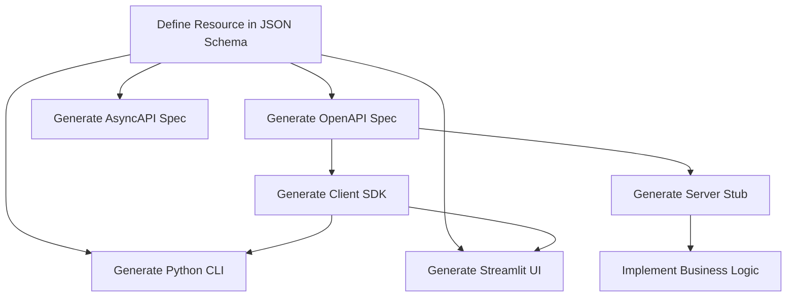

## The Traditional Approach (and Its Problems)

Let's be honest: building APIs typically involves a lot of repetitive work. Here's the traditional workflow:

1. **Design your API** - Sketch out endpoints, request/response formats
2. **Write OpenAPI spec** - Document your API in YAML or JSON
3. **Implement the server** - Build endpoints, validation, serialization
4. **Create a client** - Build SDK or library to consume the API
5. **Build a CLI** - Provide command-line access for power users
6. **Add a UI** - Create a web interface for less technical users
7. **Write tests** - Ensure everything works together
8. **Maintain consistency** - Keep spec, server, client, CLI, and UI in sync

That's **a lot** of places where things can get out of sync. Change your API design? Now you need to update the spec, server, client, CLI, UI, and tests. Miss one, and you've got bugs.

### Real-World Pain Points

**Inconsistency Everywhere**

Ever seen an API where the OpenAPI spec says one thing, but the server does another? Or where the CLI uses different parameter names than the REST API? These inconsistencies happen when you maintain multiple representations of the same resource.

**Duplication of Effort**

You end up writing the same validation logic multiple times:
- Once in JSON Schema (for the spec)
- Again in server-side validation (FastAPI, Flask, Express)
- Yet again in client-side validation (forms, CLI input)

**Slow Iteration**

Want to add a new field to your resource? Get ready to:
- Update the OpenAPI spec
- Modify the database schema
- Change server validation
- Update the client library
- Adjust CLI commands
- Modify UI forms
- Update tests

**Documentation Drift**

Documentation is almost always out of date. Why? Because it's separate from the code. Even with spec-first approaches, keeping examples, descriptions, and behavior synchronized is tedious.

## The Resource-First Philosophy

Firestone flips this model on its head. Instead of starting with APIs or implementations, **start with your resources**.

### What Is a Resource?

A resource is the fundamental "thing" your API manages. Examples:

- **User** - In a user management system
- **Order** - In an e-commerce platform
- **Address** - In a contact management app
- **DNSZone** - In a DNS management system

Resources have:
- **Properties** - Fields that describe the resource (name, email, created_at)
- **Identifiers** - Unique keys to reference specific instances (user_id, uuid)
- **Relationships** - Links to other resources (user has many orders)
- **Constraints** - Validation rules (email must be valid, age must be positive)

### Why Start Here?

**Resources are stable.** While your API design might change (REST vs GraphQL vs gRPC), your resources remain fundamentally the same. A User is a User whether you access it via HTTP, WebSocket, or CLI.

**Resources are the source of truth.** Everything else—APIs, clients, UIs—are just different *views* of your resources.

**Resources are language-agnostic.** Define them once using JSON Schema (a standard), and generate code for any language or framework.

## The Firestone Workflow

Here's how development changes with firestone:



1. **Define your resource** - Write a YAML file describing your resource using JSON Schema
2. **Generate everything** - Run firestone to create specs, CLIs, and UIs
3. **Implement business logic** - Focus on what makes your application unique
4. **Regenerate on changes** - Update the resource, regenerate outputs, done

### Benefits

**Single Source of Truth**

Your JSON Schema resource definition is the **only** place that defines:
- What fields exist
- What types they are
- What validation rules apply
- What operations are allowed

Change it once, regenerate, and everything stays in sync.

**Standards-Based**

Firestone uses JSON Schema, an established standard with:
- Widespread tool support
- Clear documentation
- Strong validation semantics
- Language-agnostic representation

You're not learning a proprietary DSL or framework-specific syntax.

**Automation**

Instead of hand-writing repetitive code, generate it:
- **OpenAPI specs** → Client SDKs (Python, Java, TypeScript, Go, etc.)
- **AsyncAPI specs** → WebSocket clients and documentation
- **Python CLIs** → Fully functional command-line tools
- **Streamlit UIs** → Interactive web dashboards

**Consistency**

When everything is generated from the same source, inconsistencies disappear:
- Field names match across spec, server, client, CLI, and UI
- Validation rules are identical everywhere
- Documentation is always current

**Rapid Iteration**

Want to add a field? Update your schema and regenerate. Everything updates automatically:

```bash
# Edit person.yaml to add "middle_name" field

firestone generate --resources person.yaml openapi > openapi.yaml
openapi-generator generate -i openapi.yaml -g python -o client/
firestone generate --resources person.yaml cli --pkg person > cli.py
```

Done. Your client now supports middle_name, your CLI has a `--middle-name` option, and your spec documents it.

## Comparison with Alternatives

Let's compare firestone's resource-first approach with other API development strategies:

### Code-First (e.g., FastAPI, NestJS)

**How it works:** Write code with decorators/annotations, generate specs from code

```python
# FastAPI example
@app.post("/users/")
async def create_user(user: User):
    return user
```

**Pros:**
- Natural for developers
- Type safety from language
- Server and spec stay in sync

**Cons:**
- Spec is a byproduct, not the design
- Client generation is an afterthought
- No automatic CLI or UI generation
- Tied to specific language/framework

**When to use:** Building a single API server in a known framework

**When to use firestone:** Need clients, CLIs, or UIs; targeting multiple languages; want framework independence

### Spec-First (e.g., OpenAPI, AsyncAPI)

**How it works:** Write OpenAPI/AsyncAPI spec manually, generate server and client code

```yaml
# OpenAPI example
paths:
  /users:
    post:
      requestBody:
        content:
          application/json:
            schema:
              $ref: '#/components/schemas/User'
```

**Pros:**
- Clear API contract upfront
- Generated clients and servers
- Language agnostic

**Cons:**
- Writing OpenAPI YAML is tedious and error-prone
- Lots of boilerplate for simple resources
- Hard to maintain as APIs grow
- No automatic CLI or UI generation

**When to use:** Standardizing on OpenAPI for governance; need exact control over spec

**When to use firestone:** Want to focus on resources, not API mechanics; need rapid iteration

### Schema-First (e.g., GraphQL)

**How it works:** Define GraphQL schema, implement resolvers

```graphql
type User {
  id: ID!
  name: String!
  email: String!
}
```

**Pros:**
- Clear data model
- Flexible querying
- Strong typing

**Cons:**
- GraphQL-specific (not REST)
- Requires GraphQL server and client infrastructure
- More complex than simple CRUD
- No automatic CLI or UI generation for non-GraphQL use cases

**When to use:** Building a GraphQL API with complex query requirements

**When to use firestone:** Need RESTful APIs, WebSocket support, or CLI/UI generation

### Resource-First (Firestone)

**How it works:** Define resources in JSON Schema, generate specs, clients, CLIs, and UIs

```yaml
# Firestone example
kind: users
schema:
  type: array
  items:
    type: object
    properties:
      name:
        type: string
      email:
        type: string
```

**Pros:**
- Start with what matters: your data
- Generate OpenAPI, AsyncAPI, CLIs, and UIs automatically
- Language and framework agnostic
- Rapid iteration with consistent outputs
- Standards-based (JSON Schema)

**Cons:**
- Requires separate business logic implementation
- Less control over exact API structure (by design)
- Learning curve for JSON Schema

**When to use:** Building resource-centric APIs; need multiple output formats; want consistency and automation

## Real-World Example: Contact Management API

Let's see the difference in practice. We'll build a simple contact management API.

### Traditional Spec-First Approach

**Step 1:** Write OpenAPI spec (addressbook-openapi.yaml, ~300 lines):

```yaml
openapi: 3.0.0
info:
  title: Addressbook API
  version: 1.0.0
paths:
  /addressbook:
    get:
      summary: List all addresses
      responses:
        '200':
          description: Success
          content:
            application/json:
              schema:
                type: array
                items:
                  $ref: '#/components/schemas/Address'
    post:
      summary: Create an address
      requestBody:
        required: true
        content:
          application/json:
            schema:
              $ref: '#/components/schemas/CreateAddress'
      responses:
        '201':
          description: Created
          content:
            application/json:
              schema:
                $ref: '#/components/schemas/Address'
  /addressbook/{address_key}:
    get:
      summary: Get an address
      parameters:
        - name: address_key
          in: path
          required: true
          schema:
            type: string
      responses:
        '200':
          description: Success
          content:
            application/json:
              schema:
                $ref: '#/components/schemas/Address'
    put:
      summary: Update an address
      # ... more boilerplate ...
    delete:
      summary: Delete an address
      # ... more boilerplate ...
components:
  schemas:
    Address:
      type: object
      properties:
        address_key:
          type: string
        street:
          type: string
        city:
          type: string
        # ... more properties ...
    CreateAddress:
      # ... duplicate with different required fields ...
    UpdateAddress:
      # ... another duplicate ...
```

**Step 2:** Generate client (manual openapi-generator command)

**Step 3:** Build CLI manually (100+ lines of Click code)

**Step 4:** Build UI manually (Streamlit/React/Vue, 200+ lines)

**Total effort:** Write 300 lines of OpenAPI + 100 lines CLI + 200 lines UI = **~600 lines of boilerplate**

### Firestone Resource-First Approach

**Step 1:** Define resource (addressbook.yaml, ~80 lines):

```yaml
kind: addressbook
apiVersion: v1
metadata:
  description: An example of an addressbook resource
methods:
  resource:
    - get
    - post
  instance:
    - delete
    - get
    - put
schema:
  type: array
  key:
    name: address_key
    description: A unique identifier for an addressbook entry
    schema:
      type: string
  items:
    type: object
    properties:
      street:
        description: The street and civic number of this address
        type: string
      city:
        description: The city of this address
        type: string
      state:
        description: The state of this address
        type: string
      country:
        description: The country of this address
        type: string
    required:
      - street
      - city
      - state
      - country
```

**Step 2:** Generate everything:

```bash
# Generate OpenAPI spec
firestone generate --resources addressbook.yaml openapi > openapi.yaml

# Generate client
openapi-generator generate -i openapi.yaml -g python -o client/

# Generate CLI
firestone generate --resources addressbook.yaml cli --pkg addressbook > cli.py

# Generate UI
firestone generate --resources addressbook.yaml streamlit > app.py
```

**Total effort:** Write 80 lines of resource YAML, run 4 commands = **~80 lines, 0 boilerplate**

### Comparison

| Approach | Lines Written | Time Spent | Consistency |
|----------|---------------|------------|-------------|
| Spec-First | ~600 | Hours | Manual sync |
| Resource-First | ~80 | Minutes | Automatic |

## When Resource-First Makes Sense

Firestone's approach shines when:

**You're building resource-centric APIs**

If your API is primarily about CRUD operations on resources (users, orders, products, etc.), resource-first is perfect.

**You need multiple output formats**

Generating OpenAPI, AsyncAPI, CLIs, and UIs from one definition saves massive time.

**You value consistency**

When the cost of inconsistency (different validation, field names, behavior) is high.

**You want rapid iteration**

When you need to experiment with resource structures and see results quickly.

**You're building a platform**

When you have many resources and need systematic API generation.

## When to Use Other Approaches

Firestone isn't a silver bullet. Consider alternatives when:

**You need fine-grained API control**

If your API has complex, non-CRUD operations (search with 20 parameters, complex workflows), hand-written specs or code-first might be better.

**You're building GraphQL-only**

If you're committed to GraphQL, use GraphQL schema-first tools.

**You have existing APIs**

If you already have APIs and just need to document them, code-first (FastAPI, NestJS) might be easier.

**You need advanced OpenAPI features**

If you need OpenAPI features beyond what firestone generates (webhooks, complex security flows), manual spec writing gives more control.

## The JSON Schema Advantage

Firestone uses JSON Schema because it's:

**Widely supported**: Validators exist in every language
**Well-documented**: Comprehensive specs and tutorials
**Expressive**: Supports complex types, validation, and composition
**Tooling-rich**: Editors, validators, and generators abound

But more importantly, JSON Schema lets you think about **data**, not **APIs**. You describe what your resources look like, and firestone figures out how to expose them via HTTP, WebSocket, CLI, and UI.

## Philosophy Summary

The resource-first philosophy boils down to:

1. **Resources are the center of your application** - Not endpoints, not HTTP methods, not UI components
2. **Define once, generate many** - Single source of truth drives all outputs
3. **Standards over invention** - Use JSON Schema, OpenAPI, AsyncAPI, not proprietary formats
4. **Automation over repetition** - Generate boilerplate, write business logic
5. **Consistency by default** - Specs, clients, CLIs, UIs all match automatically

## Next Steps

Ready to try resource-first development?

- **[Getting Started](../getting-started/)** - Install firestone and build your first resource
- **[Architecture](./architecture)** - Understand how firestone works under the hood
- **[Resource Schema Reference](../core-concepts/resource-schema)** - Learn every field and option available

